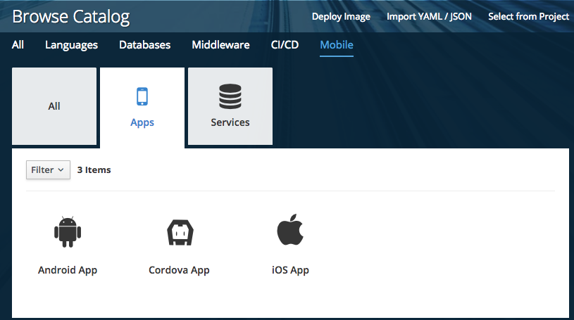
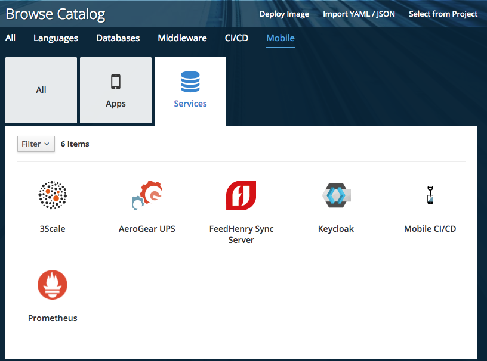
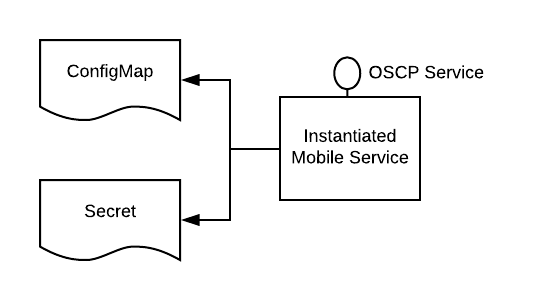
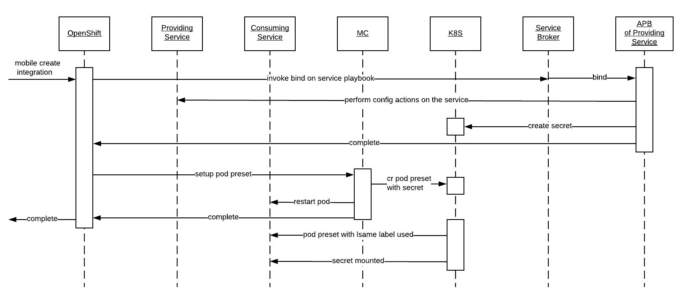

= Mobile Core (MC) Architecture Overview
:toc:

.Target Audience
****
The target audience for this document is developers who want a better understanding of what Mobile Core does, what value it brings and if they were to build a Mobile Service, how would they get MC to discover it and integrate with it.
****

== Terminology

****
*Mobile Service*;
A service which delivers functionality that can be used as part of a Mobile solution. These services are offered through the OpenShift Service Catalog.

*Mobile Client App*;
This is the Mobile Developers client application which will run on the Mobile device. It will interact with the Mobile Services which are provisioned via the SDKs.

*Mobile App Representation*;
A Mobile App Representation is a set of basic properties for the App. It is not a running process. Currently its a visual represenation of an App. It is a resource that represents your mobile client app as part of the OpenShift UI. It gives the context and information needed to show you relevant information around your particular mobile runtime as well as allowing the setup of different kind of mobile client builds required.

*Mobile Service Integration*;
A Mobile Service Integration, is one Mobile Service making use of another Mobile Service, i.e. they are integrated with each other. An example of this would be Keycloak is protecting the Synch Mobile Service. Creating Mobile Service Integrations is an important part of building a richer more enhanced overall Mobile solution. Only certain Mobile Services can integrate with other Mobile Services.
****

== Introduction
The overall goal of a full Mobile solution is a group of services working together in order to solve a problem. Each of those component services offers a piece of the functionality necessary for the solution to work. But the overall solution needs all these component parts (i.e. services) to be integrated together. MC is the component which glues/integrates/orchestrates these component services. MC is the orchestrator in the context of Mobile.

As well as the integration of Mobile Services with each other, another key aspect of building a solution is the integration with the platform, which is OpenShift. MC takes ownership of this aspect of the solution design also.

== Design Principles

MC interacts with OpenShift and the Kubernetes Core and not directly with the Mobile Services.

== MC Installation
The MC makes the Openshift platform Mobile aware. To do this the MC must perform a number of actions as part of its installation process.

* *Step 1*: Ensure that Mobile Services are made available through the Service Catalog

For mobile developers to be able to consume Mobile Services, they must be available to them. The medium through which services are presented is the https://docs.openshift.com/container-platform/3.7/architecture/service_catalog/index.html[Openshift Service Catalog]. In order to achieve this, the MC must perform a number of tasks:

** *Step 1.1*: Install / Configure an OpenShift Ansible Broker (OAB)
+
The Mobile Services are represented as APBs (Ansible Playbooks). For these playbooks to be read in, and represented through the Service Catalog, an https://docs.openshift.com/container-platform/3.7/architecture/service_catalog/ansible_service_broker.html#service-catalog-spec-file[Ansible Service Broker] must be created.
+
image:images/5.x-Architecture-MC-ASB.png["My screenshot",width=1280, caption="Figure 1: Mobile Core Installation - Integrating Mobile Services into Service Catalog", title="Mobile Core Installation - Integrating Mobile Services into Service Catalog", link="images/5.x-Architecture-MC-ASB.png"]
+
When the MC is installed, it will register a Broker with the Service Catalog. In some cases an OAB may already exist. A service broker is a server that conforms to the https://github.com/openservicebrokerapi/servicebroker/blob/v2.13/spec.md[OSB API] specification and manages a set of one or more services. The software could be hosted within your own OpenShift Container Platform cluster or elsewhere. The MC will create a specific type of Broker, an Ansible Service Broker. Once the ASB is created, it will try and invoke a GET on the its configured endpoint, to retrieve the catalog of services it has access to. The set of services are defined through Ansible playbooks, which for Mobile are located in https://github.com/aerogearcatalog[AeroGear Docker Hub]. These services are returned to the Serice Catalog and Service Class resources are created to represent each returned service type. At that point a user can see a representation of the services inside the Service Catalog.

* *Step 2*: Extend the OpenShift UI, to offer a Mobile perspective

The installation of MC also incorporates, extending the OpenShift UI. It does this by updating the Openshift master-config.yml. The MC UI is an angular application and is using angularjs version 1.5. Additional information on the customization of the Web UI is located https://docs.openshift.com/container-platform/3.7/install_config/web_console_customization.html[here].

* *Step 3*: Create a Custom Resource Definition for Mobile App REpresentations

Kubernetes offers the capability to define your own object kinds, using the https://kubernetes.io/docs/concepts/api-extension/custom-resources/[Customer Resource Definition] (CRD) concept. Rather than letting the Kubernetes core continiously expand and potentially get too unwieldly, CRDs provide a simple, yet flexible way to define your own object kinds and extend the Kubernetes core.

The MC as part of its startup procedure creates a CRD for representing Mobile Clients. At a later stage when a Mobile App representation is created, this CRD is instantiated.

.Example of CRD for a Mobile App Representation
====
 $ kubectl describe crd mobileclients.mobile.k8s.io
 Name:         mobileclients.mobile.k8s.io
 Namespace:
 Labels:       <none>
 Annotations:  <none>
 API Version:  apiextensions.k8s.io/v1beta1
 Kind:         CustomResourceDefinition
 Metadata:
   Creation Timestamp:  2018-01-04T09:56:32Z
   Resource Version:    3248
   Self Link:           /apis/apiextensions.k8s.io/v1beta1/customresourcedefinitions/mobileclients.mobile.k8s.io
   UID:                 8aced5d8-f135-11e7-95e5-b242a86257d4
 Spec:
   Group:  mobile.k8s.io
   Names:
     Kind:       MobileClient
     List Kind:  MobileClientList
     Plural:     mobileclients
     Short Names:
       mc
     Singular:  mobileclient
   Scope:       Namespaced
   Version:     v1alpha1
 Status:
   Accepted Names:
     Kind:       MobileClient
     List Kind:  MobileClientList
     Plural:     mobileclients
     Short Names:
       mc
     Singular:  mobileclient
   Conditions:
     Last Transition Time:  <nil>
     Message:               no conflicts found
     Reason:                NoConflicts
     Status:                True
     Type:                  NamesAccepted
     Last Transition Time:  2018-01-04T09:56:32Z
     Message:               the initial names have been accepted
     Reason:                InitialNamesAccepted
     Status:                True
     Type:                  Established
 Events:                    <none>
 $
====

* *Step 4*: Install the Mobile CLI

The functionality provided through the OpenShift UI is also available on the command line. MC extends the Kubernetes and OpenShift CLI to provide mobile specific commands. More details in how to extend the base CLI is available https://kubernetes.io/docs/tasks/extend-kubectl/kubectl-plugins/[here]

All of the functionality available via the UI will be available from the CLI. The mobile CLI runs standalone as well as through the _kubectl_ and _oc_ commands. E.g.

 MacBook-Pro:images joeBloggs$ mobile --help
 A brief description of your application
 Usage:
  mobile [command]
 Available Commands:
  create      create clients integrations etc...
  delete      delete clients, clientbuilds etc
  get         get clients, service and clientbuilds
  help        Help about any command
  start       start clientbuild
  stop        stop clientbuild
 Flags:
  -h, --help               help for mobile
      --namespace string   --namespace=myproject
  -o, --output string      -o=json -o=template (default "table")
 Use "mobile [command] --help" for more information about a command.
 MacBook-Pro:images joeBloggs$

There is a separate repo for the Mobile CLI. Setup and usage guides are available https://github.com/aerogear/mobile-cli[here].

 Note; currently the Mobile CLI is not installed during MC startup, but the intention is to add it to the installation process in the future.

Once installed, there is no live/running MC process/server. There is no openshift pod for MC. Once MC is installed and configured its functionality is available throughout all Openshift projects/namespaces.

== MC Functionality
=== Create a representation of a Mobile App
The MC UI extension provides the user with the capabilitiy to create a representation of a Mobile App inside their Openshift project.

MC allows the user to select the Mobile category in the Service Catalog and select a representation of an App type to create. Note; an App representation is a set of basic properties for the App. It is not a running process. Currently its a visual represenation of an App. It is a resource that represents your mobile client app as part of the OpenShift UI. It gives the context and information needed to show you relevant information around your particular mobile runtime as well as allowing the setup of different kind of mobile client builds required.

See below for an example of a Mobile App representation that uses the CRD.

.Example of an instantiated CRD for an Android Mobile App Representation
====
 $ oc get mobileclients -o=json
 {
     "apiVersion": "v1",
     "items": [
         {
             "apiVersion": "mobile.k8s.io/v1alpha1",
             "kind": "MobileClient",
             "metadata": {
                 "clusterName": "",
                 "creationTimestamp": "2018-01-04T12:35:12Z",
                 "deletionGracePeriodSeconds": null,
                 "deletionTimestamp": null,
                 "labels": {
                     "icon": "fa-android"
                 },
                 "name": "my.app-1515069311",
                 "namespace": "myproject",
                 "resourceVersion": "17980",
                 "selfLink": "/apis/mobile.k8s.io/v1alpha1/namespaces/myproject/mobileclients/my.app-1515069311",
                 "uid": "b5840229-f14b-11e7-95e5-b242a86257d4"
             },
             "spec": {
                 "apiKey": "3e88bede-0c80-4df1-8cd9-cf9b5f50b771",
                 "clientType": "android",
                 "name": "my.app"
             }
         }
     ],
     "kind": "List",
     "metadata": {
         "resourceVersion": "",
         "selfLink": ""
     }
 }
====
Further details on creating a custom resource object (instantiation of the CRD) is detailed https://kubernetes.io/docs/tasks/access-kubernetes-api/extend-api-custom-resource-definitions/[here].

=== Provision a Mobile Service
Another important stage in the Mobile App Dev process is to provision a Mobile value add Service to your project. This provisioning of a Mobile Service into your project is done via the Service Catalog, its not done through the MC. The MC UI extension has provided the Mobile category for the user to find the services which can be used as part of a Mobile solution.

What happens behind the scene is that the 'provision' ansible playbook of the service in question is invoked. This does the provisioning of the service into the project. There is an existing https://github.com/aerogear/proposals/blob/master/apbs/create-secret-and-configmap-during-provision.md[proposal] around this topic.

As part of this provisioning two objects are also created, a configMap and a secret for the new service in OpenShift, see Figure below.

The ConfigMap which is created contains public info about the Mobile Service. The info conatined in this ConfigMap is necessary for a remote/real Mobile Client/App to be able to interact with and consume the Mobile Service. It will be most likely be the Core Client SDK which will provide the Mobile Client with this configuration (https://github.com/aerogear/proposals/pull/9/files[SDK Proposal]). The Secret that is created holds private info about the service, e.g. uname and pwd.

=== Integrate two Mobile Services
The MC provides an initiation point where Mobile Services can be integrated with each other. Once there are Mobile Services provisioned, potential bindings (integrations with other Mobile Services) available for each Mobile Service is read by the MC and is presented as potential integration options for each service. The 'integrations' field in the metadata, identifies what integrations/bindings can be created for the service in question.

. Extract from the https://github.com/aerogearcatalog/fh-sync-server-apb/blob/master/apb.yml[Synch Mobile Service APB]
====
 metadata:
  displayName: FeedHenry Sync Server
  serviceName: fh-sync-server
  integrations: keycloak,apiKeys
====

When a developer decides to perform an integration between two Mobile Services, via the UI or through the CLI, e.g.

 > mobile create integration <consuming_service_instance_id> <providing_service_instance_id> --namespace=<yourProjectName>

a number of actions are taken:

* the bind APB is ran for the providing service
** Example of https://github.com/aerogearcatalog/keycloak-apb/blob/master/roles/bind-keycloak-apb/tasks/main.yml[Keycloak Bind APB]
* the MC would create a PodPreset for the consuming service.
** A https://kubernetes.io/docs/concepts/workloads/pods/podpreset/[pod preset] is an object that injects user-specified information into pods as they are created.
** The MC uses the pod preset concept to inject the secret created by the binding of the providing service into the consuming service (e.g. if you wanted to protect the Mobile Synch Service with authentication from Keycloak, the Keycloak secret would be injected into the Synch Service)
* The consuming service is restarted. This is done for it to pick up the pod preset that was injected into it.
** The consuming service will have the injected secret mounted on restart. It then determines how it shall use it, e.g. in the case of a Keycloak secret being mounted for the Synch service, it can set a flag which can be checked when incoming traffic is received and if true, it redirects the traffic to Keycloak for it to be authenticated.

In general thats the flow which occurs during service integration. Additional logic which is necessary as part of an integration is primarily developed as part of the bind APB of that service. E.g. creation of relams and clients in Keycloak, which is needed for integration with the Mobile Synch Service.

Figure above goes into more detail as to the flow and the main components involved during a service integration.

==== Possible Mobile Service Integrations Supported to Date
Below is a list of possible Mobile Service Integrations supported to date:
[%header,cols=3*]
|===
|Providing Service
|Consuming Service
|Description

|Keycloak
|Synch
|Provides Authentication and Authorisation of the Synch Server

|3Scale
|Synch
|Provide an API Server in front of the Synch Server

|3Scale
|AeroGear UPS
|Valid Integration ??

|Keycloak
|AeroGear UPS
|Valid integration ??
|===

