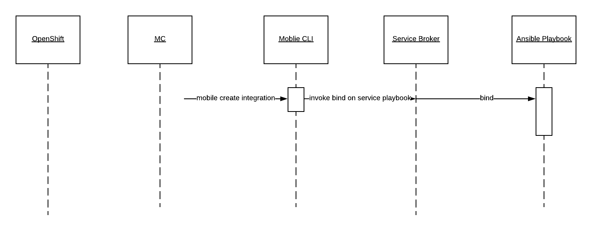

= Mobile Core (MC) Architecture Overview
:toc:

.Target Audience
****
The target audience for this document is developers who want a better understanding of what Mobile Core does, what value it brings and if they were to build a Mobile Service, how would they get MC to discover it and integrate with it.
****

== Introduction
The overall goal of a full Mobile solution is a group of services working together in order to solve a problem. Each of those component services offers a piece of the functionality necessary for the solution to work. But the overall solution needs all these component parts (i.e. services) to be integrated together. MC is the component which glues/integrates/orchestrates these componet services. MC is the orchestrator in the context of Mobile.

As well as the integration of Mobile Services with each other, another key aspect of building a solution is the integration with the platform, which is OpenShift. MC takes ownership of this aspect of the solution design also.

== Design Principles

MC interacts with OpenShift and the Kubernetes Core and not directly with the Mobile Services.

== MC Installation
The MC makes the Openshift platform Mobile aware. To do this the MC must perform a number of actions as part of its installation process.

* *Step 1*: Ensure that Mobile Specific Services are made available through the Service Catalog

For mobile developers to be able to consume Mobile value add services, they must be available to them. The medium through which services are presented is the https://docs.openshift.com/container-platform/3.6/architecture/service_catalog/index.html[Openshift Service Catalog]. In order to achieve this, the MC must perform a number of tasks:

** *Step 1.1*: Install / Configure an Ansible Service Broker
+
The Mobile value add services are represented as APBs (Ansible Playbooks). For these playbooks to be read in, and represented through the Service Catalog, an https://docs.openshift.com/container-platform/3.6/architecture/service_catalog/ansible_service_broker.html#service-catalog-spec-file[Ansible Service Broker] must be created.
+
image:images/5.x-Architecture-MC-ASB.png["My screenshot",width=1280, caption="Figure 1: Mobile Core Installation - Integrating Mobile Services into Service Catalog", title="Mobile Core Installation - Integrating Mobile Services into Service Catalog", link="images/5.x-Architecture-MC-ASB.png"]
+
When the MC is installed, it will create a representation of a Broker inside the Service Catalog. A service broker is a server that conforms to the https://github.com/openservicebrokerapi/servicebroker/blob/v2.13/spec.md[OSB API] specification and manages a set of one or more services. The software could be hosted within your own OpenShift Container Platform cluster or elsewhere. The MC will create a specific type of Broker, an Ansible Service Broker. Once the ASB is created, it will try and invoke a GET on the its configured endpoint, to retrieve the catalog of services it has access to. The set of services are defined through Ansible playbooks, which for Mobile are located in Docker Hub. These services are returned to the Serice Catalog and Service Class resources are created to represent each returned service. At that point a user can see a representation of the services inside the Service Catalog.

* *Step 2*: Extend the OpenShift UI, to offer a Mobile perspective

The installation of MC also incorporates, extending the OpenShift UI. It does this by updating the Openshift master-config.yml. The MC UI is an angular application and is using angularjs version 1.5. Additional information on the customization of the Web UI is located https://docs.openshift.com/container-platform/3.7/install_config/web_console_customization.html[here].

* *Step 3*: Create a Custom Resource Definition for Mobile App REpresentations

Kubernetes offers the capability to define your own object kinds, using the https://kubernetes.io/docs/concepts/api-extension/custom-resources/[Customer Resource Definition] (CRD) concept. Rather than letting the Kubernetes core continiously expand and potentially get too unwieldly, CRDs provide a simple, yet flexible way to define your own object kinds and extend the Kubernetes core.

The MC as part of its startup procedure creates a CRD for representing Mobile Clients. At a later stage when a Mobile App representationis created, this CRD is instantiated.

.Example of CRD for a Mobile App Representation
====
 MacBook-Pro:architecture user1$ kubectl describe crd mobileclients.mobile.k8s.io
 Name:         mobileclients.mobile.k8s.io
 Namespace:
 Labels:       <none>
 Annotations:  <none>
 API Version:  apiextensions.k8s.io/v1beta1
 Kind:         CustomResourceDefinition
 Metadata:
   Creation Timestamp:  2018-01-04T09:56:32Z
   Resource Version:    3248
   Self Link:           /apis/apiextensions.k8s.io/v1beta1/customresourcedefinitions/mobileclients.mobile.k8s.io
   UID:                 8aced5d8-f135-11e7-95e5-b242a86257d4
 Spec:
   Group:  mobile.k8s.io
   Names:
     Kind:       MobileClient
     List Kind:  MobileClientList
     Plural:     mobileclients
     Short Names:
       mc
     Singular:  mobileclient
   Scope:       Namespaced
   Version:     v1alpha1
 Status:
   Accepted Names:
     Kind:       MobileClient
     List Kind:  MobileClientList
     Plural:     mobileclients
     Short Names:
       mc
     Singular:  mobileclient
   Conditions:
     Last Transition Time:  <nil>
     Message:               no conflicts found
     Reason:                NoConflicts
     Status:                True
     Type:                  NamesAccepted
     Last Transition Time:  2018-01-04T09:56:32Z
     Message:               the initial names have been accepted
     Reason:                InitialNamesAccepted
     Status:                True
     Type:                  Established
 Events:                    <none>
 MacBook-Pro:architecture user1$
====

* *Step 4*: Install the Mobile CLI

The functionality provided through the OpenShift UI is also available on the command line. MC extends the Kubernetes and OpenShift CLI to provide mobile specific commands. More details in how to extend the base CLI is available https://kubernetes.io/docs/tasks/extend-kubectl/kubectl-plugins/[here]

All of the functionality available via the UI willbe available from the CLI. The mobile CLI runs standalone aswell as through the _kubectl_ and _oc_ commands. E.g.

 MacBook-Pro:images joeBloggs$ mobile --help
 A brief description of your application
 Usage:
  mobile [command]
 Available Commands:
  create      create clients integrations etc...
  delete      delete clients, clientbuilds etc
  get         get clients, service and clientbuilds
  help        Help about any command
  start       start clientbuild
  stop        stop clientbuild
 Flags:
  -h, --help               help for mobile
      --namespace string   --namespace=myproject
  -o, --output string      -o=json -o=template (default "table")
 Use "mobile [command] --help" for more information about a command.
 MacBook-Pro:images joeBloggs$

There is a separate repo for the Mobile CLI. Setup and usage guides are available https://github.com/aerogear/mobile-cli[here].

 Note; currently the Mobile CLI is not installed during MC startup, but the intention is to add it to the installation process.

Once installed, there is no live/running MC process/server. There is no openshift pod for MC. Once MC is installed and configured its functionality is available throughout all Openshift projects/namespaces.

== MC Functionality
=== Create a representation of a Mobile App
The MC UI extension provides the user with the capabilitiy to create a representation of a Mobile App inside their Openshift project.

MC allows the user to select the Mobile filter in the Service Catalog and select a representation of an App type to create. Note; an App representation is a set of configuration properties which any mobile client needs for it to communicate back to the Mobile Core.

image::images/5.x-ServiceCatalog-MobileApps.png[width=1280, title="Service Catalog - Mobile App Perspective", link="images/5.x-ServiceCatalog-MobileApps.png"]

The MC creates a Secret with the credentials/properties of the Mobile App and presents these in the Openshift UI. These credentials will need to be injected into a Mobile Client for it to communicate with the MC and potentially use deployed Mobile Services. Its the MC which creates this secret in OpenShift when the Mobile App representation is created from the catalog.

[red]#Are the above statements correct? Its the catalog which allows selection of an App and its the ASB which provisions the instance. How does MC logic get triggered to go on and create the secret, it doesn't have and listening process for Openshift events?#

.Example of an instantiated CRD for an Android Mobile App Representation
====
 MacBook-Pro:architecture user1$ oc get mobileclients -o=json
 {
     "apiVersion": "v1",
     "items": [
         {
             "apiVersion": "mobile.k8s.io/v1alpha1",
             "kind": "MobileClient",
             "metadata": {
                 "clusterName": "",
                 "creationTimestamp": "2018-01-04T12:35:12Z",
                 "deletionGracePeriodSeconds": null,
                 "deletionTimestamp": null,
                 "labels": {
                     "icon": "fa-android"
                 },
                 "name": "my.app-1515069311",
                 "namespace": "myproject",
                 "resourceVersion": "17980",
                 "selfLink": "/apis/mobile.k8s.io/v1alpha1/namespaces/myproject/mobileclients/my.app-1515069311",
                 "uid": "b5840229-f14b-11e7-95e5-b242a86257d4"
             },
             "spec": {
                 "apiKey": "3e88bede-0c80-4df1-8cd9-cf9b5f50b771",
                 "clientType": "android",
                 "name": "my.app"
             }
         }
     ],
     "kind": "List",
     "metadata": {
         "resourceVersion": "",
         "selfLink": ""
     }
 }
====

[red]#Is the goal of the secret for the App Rrepresentation just such that a Mobile Client is capable of talking to the MC? What about getting the SDK?#

=== Instantiate a Mobile Service
Another important stage in the Mobile App Dev process is to instantiate a Mobile value add Service to your project. This instantiation of a Mobile Service into you project is done via the Service Catalog, its not done through the MC.

image::images/5.x-ServiceCatalog-MobileServices.png[width=1280, title="Service Catalog - Mobile Service Perspective", link="images/5.x-ServiceCatalog-MobileServices.png"]

What happens behind the scene is that the 'provision' ansible playbook of the service in question is invoked. This does the provisioning of the service into the project.

When this provisioning is complete, MC creates secret(s) for the new service in OpenShift.

[red]#_Does MC do anything else at this point? Also, is there an event mechanism which MC is subscribing to, to detect application provisioning success in Openshift?_#

NEW; create diagram here with resources which are create when a Mobile Service is instantiated, e.g. ConfigMap (Public info about SVC for remote/real Mobile Client to use in order to consume the Service), Secret (private info about teh service, e.g. uname and pwd. The secret is not publically available).

=== Integrate two Mobile Services
It provides an initiation point where Mobile Services can be integrated with each other. Once there are Mobile Services provisioned, potential bindings available for each Mobile Service is read by MC and is presented as potential integration options for each service.

[red]#**_How is this info extracted from the service, via some property in the service class?_**#

When a developer decides to perform an integration between two Mobile Services, via the UI or through the CLI, e.g.

 > mobile create integration <consuming_service_instance_id> <providing_service_instance_id> --namespace=<yourProjectName>

a number of actions are taken:

* the bind APB is ran for each of the contributing services, both the consuming and the providing
** [red]#Not invoking a bind for each service. Just one service#
** Example of https://github.com/aerogearcatalog/keycloak-apb/blob/master/roles/bind-keycloak-apb/tasks/main.yml[Keycloak Bind APB]
* the MC would create a PodPreset for the consuming service.
** A https://docs.openshift.com/container-platform/3.6/dev_guide/pod_preset.html[pod preset] is an object that injects user-specified information into pods as they are created.
** The MC uses the pod preset concept to inject the secret created by the binding of the providing service into the consuming service (e.g. if you wanted to protect the Mobile Synch Service with authentication from Keycloak, the Keycloak secret would be injected into the Synch Service)
* The consuming service is restarted. This is done for it to pick up the pod preset that was injected into it.
** What is done by the Synch Service when it restarts, it has a link to the secret, is there some endpoint that it must hit to trigger it into action.

NEW; Generic info is correct here

In general thats the flow which occurs during service integration. With some specific integrations, the MC does additioanl things to facilitate the integration in question. E.g. creation of relams and clients in Keycloak, which is needed for integration with the Mobile Synch Service. Sub chapters below highlight some of the specific logic which MC performs with certain integrations.

[red]#Want to flesh out the above flow!!#
NEW; ensure that K8S, Service Catalog, Service Broker, APB are shown here. There are the main pillars of the flow.

==== Mobile Synch Service / Keycloak Integration
MC does perform some additional logic when integrating these two mobile services.

[red]#Should we go into each integration?#

==== Mobile Synch Service / 3Scale Integration
_Are there specifics which we should higlight here?_

==== Possible Mobile Integrations to Date
New; this table is probably enough here
Below is a list of possible Mobile Service Integrations supported to date:
[%header,cols=3*]
|===
|Providing Service
|Consuming Service
|Description

|Keycloak
|Feedhenry Synch Server
|Provides Authentication and Authorisation of the Synch Server

|3Scale
|Feedhenry Synch Server
|Provide an API Server in front of the Synch Server

|3Scale
|AeroGear UPS
|Valid Integration ??

|Keycloak
|AeroGear UPS
|Valid integration ??
|===

== What a Mobile Service Developer needs to do to be discovered and used by MC
NEW; use the whiteboard diagram
* provide a ASB with appropriate playbooks
** provision new instances
** bind to an instance
** unbind
** deprovision
* tagging the playbook with mobile-service
** tags:
  - mobile-service
* specift somehow what other service that your service can integrate with
** metadata:
  displayName: FeedHenry Sync Server
  serviceName: fh-sync-server
  integrations: keycloak,apiKeys
* label the ConfigMap which is created in Openshift, which makes it mobile specific

==== Other Points to include

The MCP should be able to invoke getSDConfig(serviceName) and get the Secret returned from that Mobile Service.

===== Terminology

Side-car concept
Its a sub-process to a degree which performs some task along with the main function of the Pod
It will be the responsibility of the APB for the Service in question to code the side-car functionality, e.g.
create a process which monitors users being created inside OpenShift and propagate those onto new users inside Keycloak.

===== Service Brokers

K8S wraps the OpenService Broker API, which is called the K8S Service Catalogue API

K8S's core is too big and service catalog API server is outside the core.

Implement the Open Service Broker API
Specific instance of one of the Brokers - Ansible Service Broker
It picks up the Ansible Playbooks of different services (how does it know where to look for these?)
