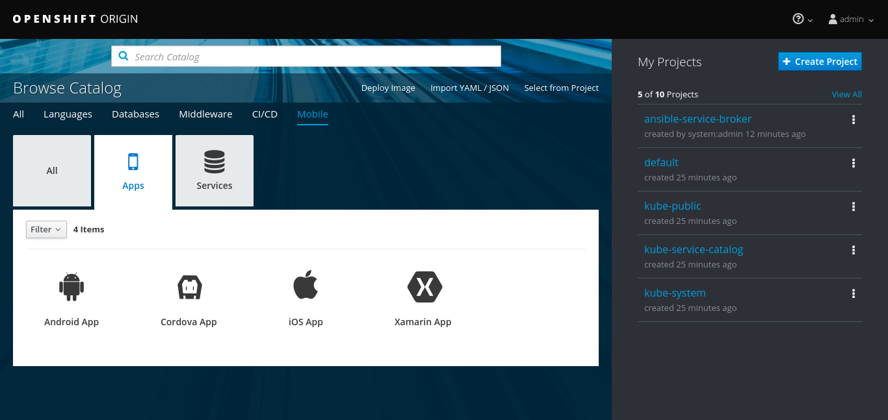

[[minishft-getting-started]]
= Getting started with minishift

The aim of this document is to get you up and running with a mobile enabled OpenShift. It will walk you through installing all the base pieces and required configuration. In other guides we will show you how to make use of this installation by representing your mobile clients as resources in OpenShift and provision mobile enabled services, simply and easily using the OpenShift Catalog along with consuming these services from your mobile clients.


[[prerequesites]]
== Pre-requesites

To enable mobile on your OpenShift cluster, we have created a minishift addon that will install and configure everything that is required.

Recommended minishift version: `1.11`.

Please refer to the official for detailed minishift information/guides: https://docs.openshift.org/latest/minishift/getting-started/preparing-to-install.html[minishift documentation].


[[minishift-mobile-addon]]
== Minishift Mobile Addon

The upstream mobile addon documentation can be found in this url: https://github.com/aerogear/minishift-mobilecore-addon/blob/master/docs/minishift_install.adoc

[[minishift-mobile-addon-installation]]
=== Installation

Clone the minishift mobile addon repository (make sure it is always using the latest commit from master branch):

```
git clone https://github.com/aerogear/minishift-mobilecore-addon
```


Run the following command to install the addon in minishift:

```
minishift addons install -f minishift-mobilecore-addon/
``` 

You can optionally enable the addon so it will always be available when you start a new minishift instance:

```
minishift addons enable minishift-mobilecore-addon
```

[[minishift-mobile-addon-bootstrap]]
=== Bootstrap

The following env vars should be set before starting minishift

```
export MINISHIFT_ENABLE_EXPERIMENTAL=y #required for service catalog
export CONTAINER_REPO_USERNAME=<docker hub username>
export CONTAINER_REPO_PASSWORD=<docker hub password>
export CONTAINER_REPO_ORG=<docker hub organization> # by default its aerogearcatalog
```

Set some of those env vars as minishift addons vars:

```
minishift config set addon-env CONTAINER_REPO_USERNAME=${CONTAINER_REPO_USERNAME},CONTAINER_REPO_PASSWORD=${CONTAINER_REPO_PASSWORD}
```

For a better experience, it is recommended that you increase the resources allocated to your minishift vm. To do this run the following commands:

```
minishift config set cpus 4
minishift config set memory 4096
```

Check your minishift config file:

```
$ cat ~/.minishift/config/config.json
{
    "addon-env": [
        "CONTAINER_REPO_USERNAME=<docker hub username>",
        "CONTAINER_REPO_PASSWORD=<docker hub password>"
    ],
    "addons": {
        "minishift-mobilecore-addon": {
            "Name": "minishift-mobilecore-addon",
            "Enabled": true,
            "Priority": 0
        }
    },
    "cpus": 4,
    "memory": "4096"
}
```

Enable the admin-user addons by default (or apply it later):

```
minishift addons enable admin-user
```

Start minishift with the following command (may take a while):

```
minishift start --openshift-version v3.9.0 --service-catalog
```

You need to apply the mobile addon if you didn't enable it before starting minishift:

```
minishift addons apply minishift-mobilecore-addon
```

[[minishift-mobile-addon-check-installation]]
=== Checking the installation

Login as the admin user which has cluster-admin access:

```
oc login -u admin -p admin
```

The ansible service broker pod needs to be running before we can use minishift's mobile features:

```
#not ready yet - both asb and asb-etcd pods need to be running
$ oc get pods -n ansible-service-broker
NAME               READY     STATUS              RESTARTS   AGE
asb-1-deploy       1/1       Running             0          2m
asb-1-pcwhr        0/1       ContainerCreating   0          1m
asb-etcd-1-gwcbj   1/1       Running             0          1m

#ansible service broker is ready
$ oc get pods -n ansible-service-broker
NAME               READY     STATUS    RESTARTS   AGE
asb-1-pcwhr        1/1       Running   0          22m
asb-etcd-1-gwcbj   1/1       Running   0          22m
```

You can open openshift web ui by running the following command (you will need to accept the self signed certificate):

```
minishift console
```

You can use either the developer or the admin user in openshit web ui.

You should see the "mobile" tab under the catalog categories once logged in:



