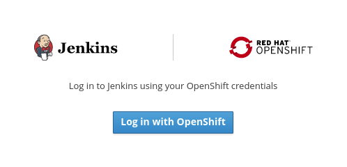

[[access-mobile-client-build-logs]]
= Access the build log of a Mobile Client Build

== Overview

This document outlines how to review a build log of a mobile client build that utilizes the Mobile CI/CD service.

== Prerequisites

* Mobile client representation for the appropriate client type.
* Mobile CI/CD service provisioned and ready within the same namespace.
* At least one client build configuration set-up in the namespace

== Openshift Console

=== Accessing a pipeline build 

All of the builds related to your mobile client can be seen in the **Builds** tab of your mobile client. Each build can be expanded to show further information about the build configuration, latest build and build history.

The latest build, as well as previous builds, has a `View Log` link associated with them to access the logs of that build.

image::images/mobile-ci-cd-access-logs-0.png[access-build-from-notification][align="center"]

==== Logging into Jenkins to access the logs

When the `View Log` link is clicked, you will be redirected to the Jenkins instance that has been running your build.

===== Openshift Login

You might be prompted to log-in through Openshift and be redirected to the Openshit login screen to authorize information transfer between Openshift and Jenkins.

[.text-center]

===== Authorize access

If this is the first time you are using the account to login to Jenkins, you will be asked to approve access for the following permissions:

* user:info permission
* user:check-access permission

[.text-center]
image::images/mobile-ci-cd-access-logs-2.png[authorize-access]

==== Reviewing the build-log

Once you have been redirected to the Jenkins UI, you should see the log of the build. Based on your permissions to the Openshift project, you might have access to other Jenkins capabilities, such as inspecting the build configuration or re-running the build with changes in the pipeline script.
