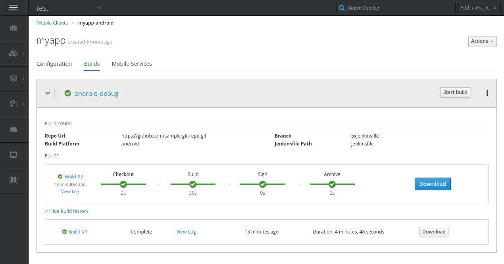
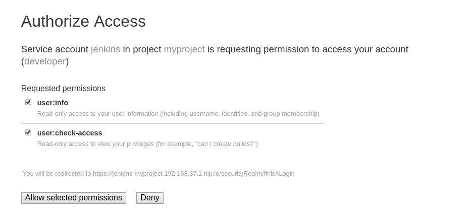

[[access-mobile-client-build-logs]]
= Access the build log of a Mobile Client Build

== Overview

This document outlines how to review a build log of a client builds that utilise the Mobile CI/CD service.

== Prerequisites

* Mobile client representation for the appropriate client type.
* Mobile CI/CD service provisioned and ready within the same namespace.
* Mobile CI/CD at least one client build configuration set-up in the namespace

== Openshift Console

=== Accessing a pipeline build 

All of the Mobile Client Builds can be found as pipeline builds in the Openshift Console.
If you just started a build, you can click the green notification to navigate to the relevant page.

Otherwise, navigate through the menu
* Expand the side-bar menu through the hamburger icon
* Hover over `Builds`
* Click `Pipelines`

image::images/mobile-ci-cd-access-logs-1.png[access-build-from-menu]

There you should be able to find a `View Log` link.

==== Logging into Jenkins to access the logs

After you clicked the `View Log` link, you will be redirected to the Jenkins instance that has been running your build.
You might be prompted to log-in through Openshift, redirected to Openshit login screen and, if this is the first time you are using this account to
login to Jenkins, asked to authorize information transfer between Openshift and Jenkins to facilitate the login.

===== Openshift login

image::images/mobile-ci-cd-access-logs-3.png[jenkins-openshift-login]

image::images/mobile-ci-cd-access-logs-4.png[openshift-login]

===== Authorize access

If you are asked to authorize permissions, you should be asked to approve access for:
* user:info permission
* user:authorize-access

image::images/mobile-ci-cd-access-logs-5.png[authorize-access]

==== Reviewing the build-log

Now you should have been redirected to Jenkins UI, and see the log of the build. Based on your permissions to the Openshift project,
you might have access to other Jenkins capabilities, such as inspecting the build configuration or re-running the build with changes in the pipeline script.

image::images/mobile-ci-cd-access-logs-6.png[review-log]
