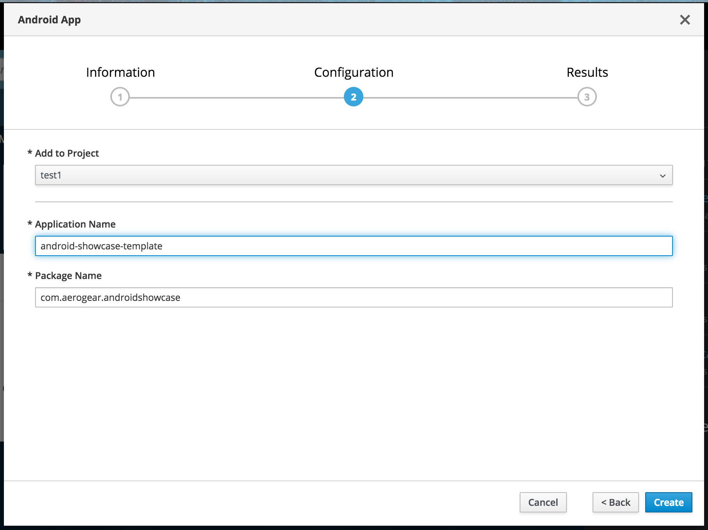
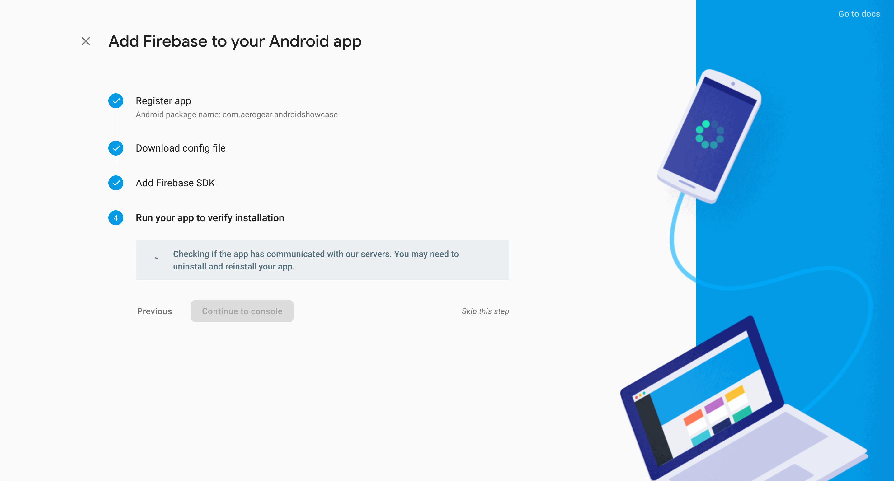

[[mobile-core-public-ip]]
= Mobile Core installation with public IP

To use your local OpenShift cluster for mobile development using a real device rather than an emulator, you will need to specify the public IP address of your local machine.

NOTE: You can do this during the setup of mobile using the install script in this repo and provide following parameters
```
Use public IP yes/no?: _yes_
Cluster IP local/public: <your-eth0-ip>|<your-wlan0-ip>
```
image::images/mobile-core-public-ip-setup.png[openshift-mobile-core-public-ip-setup]
Find IP address of your local machine you can with this command ```ifconfig | grep inet```.
Output should look like this
```
	inet 127.0.0.1 netmask 0xff000000
	inet 10.40.3.70 netmask 0xfffffe00 broadcast 10.40.3.255
```
When installation is finished and successful you should get same result as on image below

image::images/mobile-core-public-ip-success.png[openshift-mobile-core-public-ip-success]
Web console URL should contain your public IP address in this case it is `10.40.3.70`

[[mobile-core-services]]
= Provision Mobile services in Openshift
Now we need to login into _https://10.40.3.70:8443/console_, create project e.g. _test1_ and provision mobile services
Let us provision Android mobile client from https://github.com/aerogear/android-showcase-template[android-showcase-template] application in _test1_ project


Also we need to provision KeyCloak, Unified Push and Metrics mobile services in _test1_ project


After all services are successfuly provisioned, next step is to bind them with our mobile client
Open _android-showcase-template_ application under _Mobile Clients_ view and go to Mobile Services tab


Create bindings to KeyCloak, Metrics and Unified Push services. For Unified Push server you need provide 2 parameters,
_Server key_[Your Google Key for Firebase Cloud Messaging] and _Sender Id_[Your FCM Project Number, needed on the mobile client for connecting with FCM]
You can obtain these parameters from https://console.firebase.google.com[Firebase] console after creating new project

image::images/mobile-client-firebase-parameters.png[openshift-mobile-client-firebase-parameters]
Pass _Server key_ and _Sender Id_ as Create Binding parameters


Press Bind button and wait until binding process is finished and binding is successfully created


Bindings to all services should be successfully created and VARIANTS for Unified Push server generated. You can see it on following screen


[[mobile-client-connect]]
= Add Firebase to your Android application
First you need to login again into https://console.firebase.google.com[Firebase] console and create Android application under
Firebase project


Provide package name for your application, in this case it is _com.aerogear.androidshowcase_
Other fields should be empty, they are optional


= Download google-services.json config file
Next step is downloading google services configuration locally on your machine

image::images/mobile-client-firebase-download-config.png[openshift-mobile-client-firebase-download-config]
Press [Download google-services.json] button and save configuration
= Add Firebase SDK
If your mobile-client app does not use Firebase SDK, you need to add it as described on following screen


After Firebase SDK was added you can move to next step

= Run your app verify installation
If you add Firebase to Android app you can test if app is communicating with google services


Skip this step and you should be redirected to Android apps overview

image::images/mobile-client-firebase-app-overview.png[openshift-mobile-client-firebase-app-overview]
Now you can see that Android app created with _App ID_ and _Package Name_ and we can proceed with Android app configuration

= Configure your Android app in Android Studio
== Copy content of google-services.json into app/google-services.json
Following snippet is example how _google-services.json_ should look like, project number and api key should be different for your Android app
```
{
  "project_info": {
    "project_number": "<project-number>",
    "firebase_url": "https://mobile-client-12385.firebaseio.com",
    "project_id": "mobile-client-12385",
    "storage_bucket": "mobile-client-12385.appspot.com"
  },
  "client": [
    {
      "client_info": {
        "mobilesdk_app_id": "1:<project-number>:android:62xxxxxxxxxx9df",
        "android_client_info": {
          "package_name": "com.aerogear.androidshowcase"
        }
      },
      "oauth_client": [
        {
          "client_id": "<project-number>-hckp0xxxxxxxxxxxxxxxxxxxx384pg1l.apps.googleusercontent.com",
          "client_type": 3
        },
        {
          "client_id": "<project-number>-hckp0xxxxxxxxxxxxxxxxxxxx384pg1l.apps.googleusercontent.com",
          "client_type": 3
        }
      ],
      "api_key": [
        {
          "current_key": "<api-key>"
        }
      ],
      "services": {
        "analytics_service": {
          "status": 1
        },
        "appinvite_service": {
          "status": 1,
          "other_platform_oauth_client": []
        },
        "ads_service": {
          "status": 2
        }
      }
    }
  ],
  "configuration_version": "1"
}
```

== Copy content of mobile-services.json into app/src/main/assets/mobile-services.json
Following snippet is example how _mobile-services.json_ should look like, sender id should be taken from from https://console.firebase.google.com[Firebase] console
```
{
  "version": 1,
  "clusterName": "https://10.40.3.70:8443",
  "namespace": "test1",
  "clientId": "android-showcase-template-android",
  "services": [
    {
      "id": "keycloak-android-showcase-template-android-public",
      "name": "keycloak",
      "type": "keycloak",
      "url": "https://keycloak-test1.10.40.3.70.nip.io/auth",
      "config": {
        "auth-server-url": "https://keycloak-test1.10.40.3.70.nip.io/auth",
        "confidential-port": 0,
        "public-client": true,
        "realm": "test1",
        "resource": "android-showcase-template-android-public",
        "ssl-required": "external"
      }
    },
    {
      "id": "metrics-android-showcase-template-android",
      "name": "metrics",
      "type": "metrics",
      "url": "https://aerogear-app-metrics-test1.10.40.3.70.nip.io/metrics",
      "config": {}
    },
    {
      "id": "ups-secret-android-showcase-template-android-c5gh0",
      "name": "ups",
      "type": "push",
      "url": "https://ups-test1.10.40.3.70.nip.io/",
      "config": {
        "android": {
          "senderId": "<sender-id>",
          "variantId": "b1f8e3a6-818d-4cf4-8e17-eb6c3959a4f6",
          "variantSecret": "f9af90dd-a525-4744-8c96-ceaab9bde443"
        }
      }
    }
  ]
}
```
Mobile services configuration is located in https://10.40.3.25:8443/console[Openshift] console under _Mobile Clients_ if you expend _android-showcase-template_ application


Now we can move to device configuration and allow Android device to communicate with your mobile services

== Export self signed certificate for Openshift
First step is to extract self signed certificate from your https://10.40.3.25:8443/console[Openshift] console.
Navigate to https://10.40.3.25:8443/console[Openshift] console and open SSL details of your connection then press [>] button

image::images/mobile-core-self-signed-cert-open.png[openshift-mobile-core-self-signed-cert-open]
Next open [Security] tab and pres [View Certificate] button. When you see Certificate Hierarchy, press the top element, e.g. openshift-signer@1528732794 in hierarchy and press [Export] button


Save self signed certificate locally on yout machine disk and transfer to your device via USB or another appropriate method

== Open self signed certificate on Android device
Open downloaded or saved self signed certificate on your device and provide Certificate name, e.g. OCSSL

image::images/mobile-client-self-signed-cert-import.png[openshift-mobile-core-self-signed-cert-import]
To use credential store you need set lock screen PIN or password if you dont have it already


Then you should see message that OCSSL self signed certificate is installed


Now you dont need to worry about blockign connection from your device to mobile services

== Connect your Android device to Unified Push mobile service
When self OCSSL signed certificate is imported and configurations are copy/pasted you need to build _android-showcase-template_ app on device and verify it is communicating with mobile service

=== Connect AVD

This example shows that mobile client is connected to Unified Push service and you can send push notifications
from Unified Push server console directly to AVD

=== Connect Android device
When real device is on same network it should also get same Push notifications as AVD above


== Connect your Android device to KeyCloak mobile service
When self OCSSL signed certificate is imported and configurations are copy/pasted you need to build _android-showcase-template_ app on device and verify it is communicating with mobile service


Press [Authenticate] button


Provide username/password for your user


When login was successful you should see above screen with _uma_authorization_ role