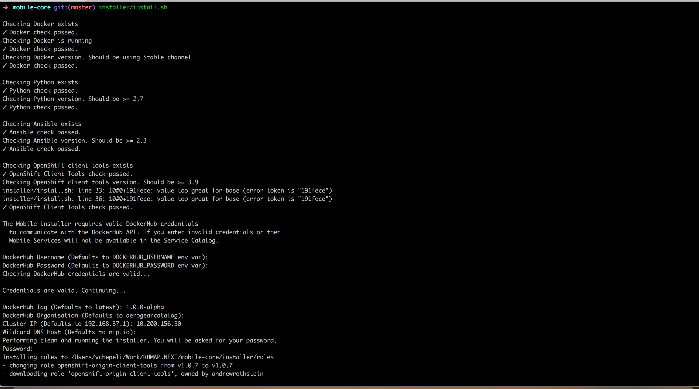

[[mobile-core-use-public-ip-addr]]
= Mobile Core installation with public IP

To use your local OpenShift cluster for mobile development using a real device rather than an emulator, you will need to specify the <eth0>|<wlan0> IP address of your local machine.
Android or iOS device should be on connected on same <eth0>|<wlan0> network as your development machine/laptop

NOTE: You can do this during the setup of mobile using the install script in this repo and provide following parameter
```
Cluster IP (Defaults to 192.168.37.1): <eth0-ip>|<wlan0-ip>
```

Find IP addresses of your local machine you can with this command ```ifconfig | grep inet```.
Output should be like this
```
	inet 127.0.0.1 netmask 0xff000000
	inet 10.40.2.105 netmask 0xfffffe00 broadcast 10.40.3.255
	inet 10.200.156.50 netmask 0xfffff800 broadcast 10.200.159.255
```
You have two IP address available for WiFi and ethernet networks, in this example WiFi network and its ip address(10.200.156.50) is used.
Another way how to find IP address of your network interface is Open Network Preferences...


When installation is finished and successful you should get same result as on image below


Web console URL should contain your public IP address, in this case it should be `10.200.156.50`