[[create-mobile-client-build]]
= Create a Mobile Client Build

== Overview

This document outlines how to create mobile client builds that utilise the Mobile CI/CD service to create binary artifacts of your mobile applications.

== Supported client types

* Android
* iOS
* Cordova

== Prerequisites

* Mobile client representation for the appropriate client type.
* Mobile CI/CD service provisioned and ready within the same namespace.

== Openshift Console

=== Creating a build

You can create a new client build for an existing mobile client via the OpenShift UI by locating the mobile client you want to create a build for in the project overview screen. Then:

* Clicking the name of this client to open the mobile client details view.
* At the top right is a drop down button with a set of actions. One of these actions will be `Create Build`, this will open a new client build form.
* Give the new build a unique name

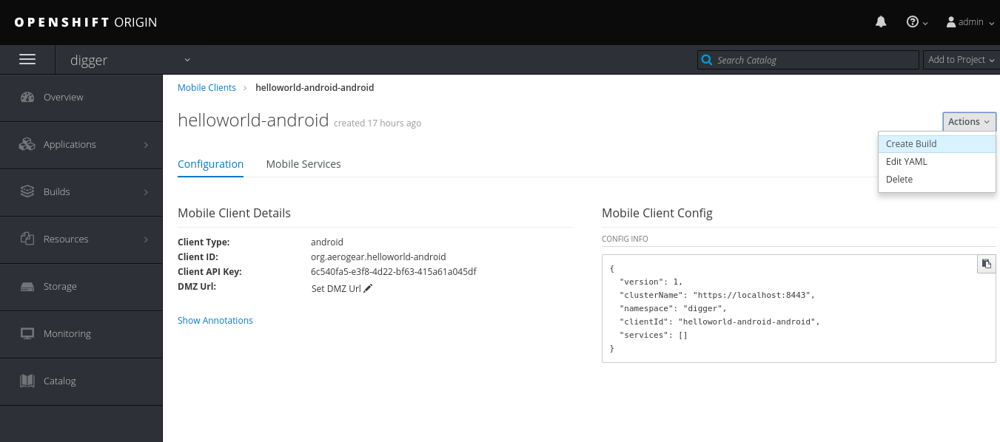

==== Source Configuration

In order to build your application, source configuration needs to be supplied to provide information about where the application source is and how it can be accessed.

===== Repository

* Add Git Repository URL. To provide additional advanced information such as a different git ref (default is master), or Jenkinsfile path (default is the root of the repo), use the advanced options.
* Add Authentication Type:
** *Public*: Use this for public repos that require no authentication.
** *Basic Authentication:* Username/password credentials, use this for https/http repo urls that require authentication.
** *SSH Key:* SSH Private Key Authentication, use this for ssh repo urls (git@).

When adding credentials to access private repositories (Basic Authentication and SSH Key), a unique name should be supplied.

===== Advanced Options

Selecting the "advanced options" in the source configuration section displays a number of additional options:

* *Git Reference*: Optional branch, tag, or commit to checkout, default is master. This option can be used to select different branches of you application repo for different builds e.g. release vs develop
* *Jenkins file path*: Optional path to where the Jenkinsfile is located in your application repo, default is the root of the repo.

====== HTTP public repository config

image::images/mobile-ci-cd-client-build-1.png[android-release-build]


====== HTTP private repository config

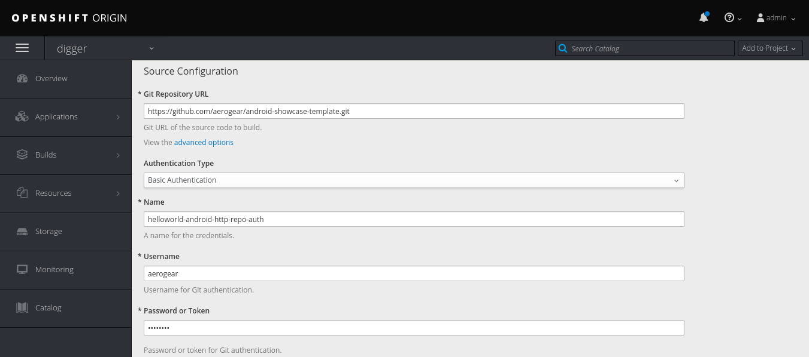


====== SSH auth repository config

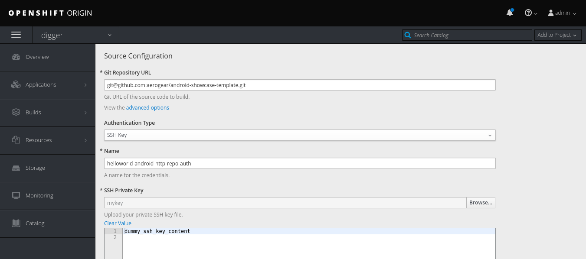


=== Build Configuration

Add configuration relating to the type of build being created e.g debug or release. The type of information required here will depend on the type of application being built.

[[android-build-configuration]]
==== Android

* Add Build Type:
** *Debug:* An Android debug build, no additional information required
** *Release:* An Android release build, requires an upload of a password protected PKCS12 file containing a key protected by the same password.

===== Release Build Type

As a release build will need to be signed, you need to specify the keystore and private key passwords.

===== Keystore located in source code
If your keystore is checked into your source code, you will need to take the password value in your build script as an environmental variable. This will allow
you to set this environmental variable as part of your client build from within the OpenShift UI. This can be done directly when creating the mobile client build or afterwards by editing the build config.

===== External keystore
If you have an external keystore, you should ensure to select the checkbox to use an external keystore once this is done, you
will be asked for the following additional information:

* *Name:* A unique name for the android credentials you are adding e.g. my-android-release-cert
* *Android KeyStore:* Password protected PKCS12 file containing a key protected by the same password

The PKSC12 archive of your android keystore certificate can be generated using the following command:

```
keytool -importkeystore -srckeystore <your-android-cert.keystore> -destkeystore <your-android-cert>.p12 -deststoretype PKCS12 -srcalias <your-android-cert-alias>
```

** *KeyStore Password:* The password for the android keystore and the PKCS12 archive (The password for the archive and the keystore must be the same)
** *KeyStore Alias:* The entry name of the private key/certificate chain you want to use to sign your APK(s). This entry must exist in the key store uploaded. If your key store contains only one key entry, which is the most common case, you can leave this field blank.

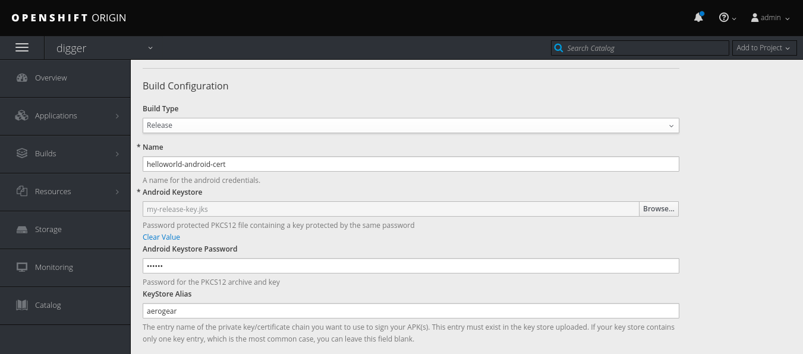

[[ios-build-configuration]]
==== iOS

* *Build Type:* Build type value to be used by xcodebuild
* *Name:* The unique credential name to be used in jenkins
* *Apple Developer Profile:* An xcode zip generated file that contains all required files (certificate, private key and provisioning profile) to sign an iOS app. For more information, see https://help.apple.com/xcode/mac/8.0/#/dev8a2822e0b[this documentation] on exporting developer accounts in XCode.
* *Apple Developer Profile Password:* The developer profile password to be used by jenkins when importing the developer profiles private key.

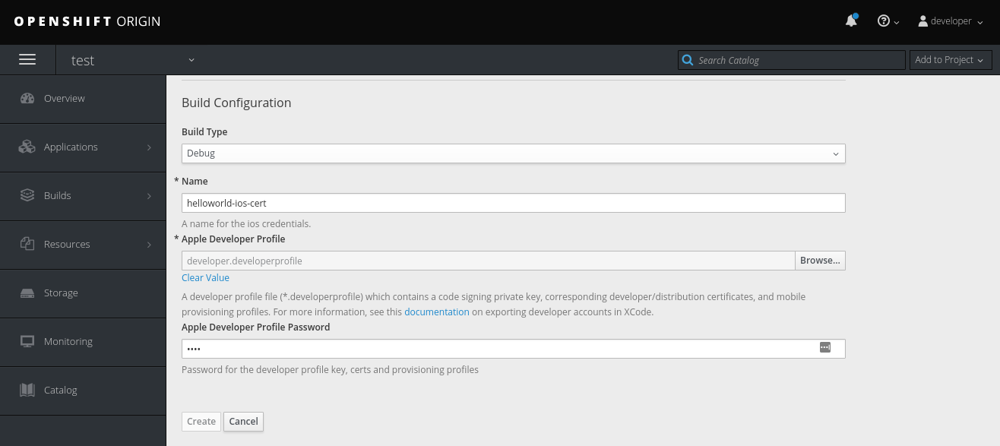

==== Cordova
* *Platform:* The platform that the app will target.
* *Build Type:* The build type value (debug or release). Depending on the platform selected, this may result in additional parameters to be required.
- For Android, see the <<android-build-configuration, Android build configuration>> section.
- For iOS, see the <<ios-build-configuration, iOS build configuration>> section.

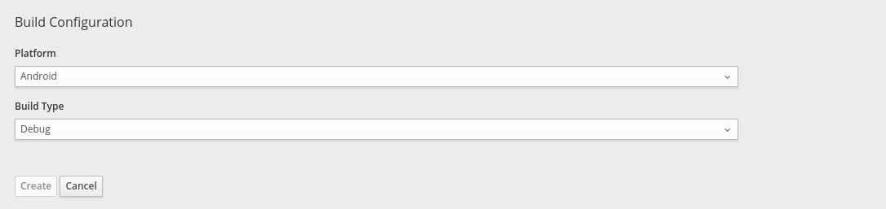


=== Build Status

==== Mobile Client Overview

You can check your mobile build status by expanding a mobile client box:

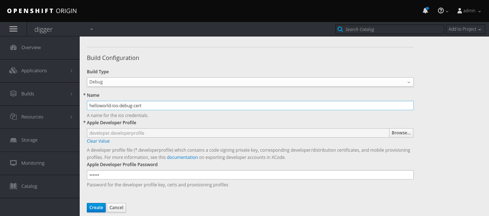


This box lists the last 5 builds for this client:

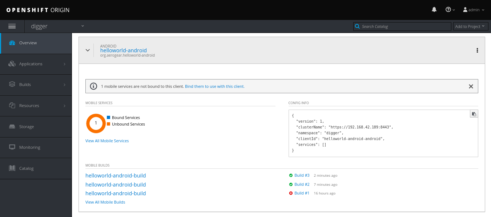

You can either click on one specific build or check all pipeline builds for this mobile client app.

==== Openshift Pipeline

Mobile client builds are just openshift pipeline builds which are listed in `Builds > Pipeline` from the left menu.

Each build step will be displayed (along with the current step status: completed, error or running) based on the defined stages in your Jenkinsfile code:

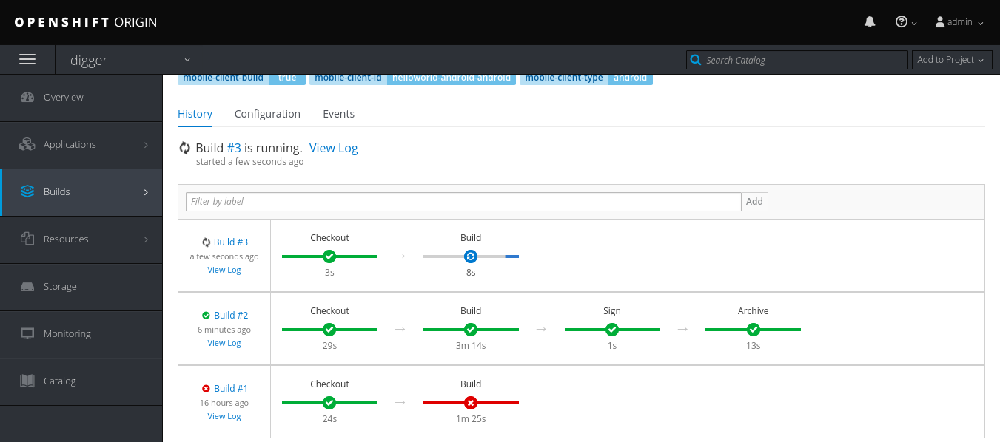

You can check the full build log by clicking on "view log" which will redirect you to your Jenkins instance. 

=== Build History

You can see your client's previous builds by going into the `Build` tab of your client's overview page.

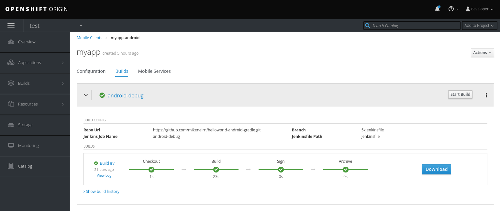

The build history for each build can be seen by clicking on `Show build history` under the `Builds` section of the selected build.

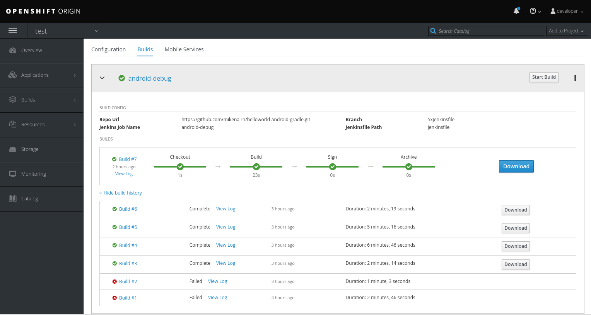

From here, you can view a build's logs, check it's status, duration and when it was created. Each build is linked to the openshift build view with further information. 

The artefact for each successful builds can also be retrieved from here by clicking on the `Download` button associated with the build you wish to download.

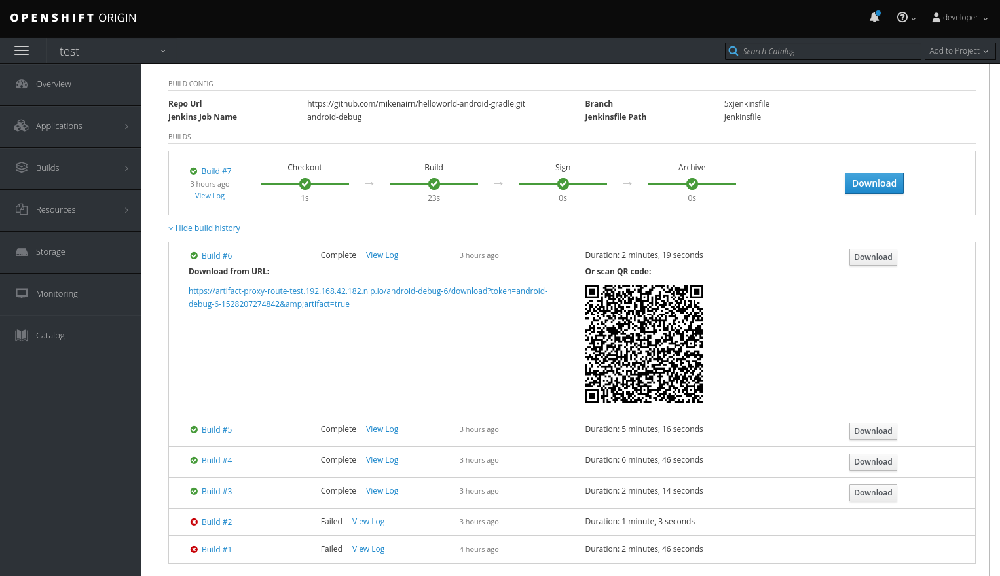

== CLI

Sample BuildConfig file:

```yml
Kind: BuildConfig
apiVersion: v1
metadata:
  name: helloworld-android
spec:
  source:
    git:
      uri: https://github.com/aerogear/android-showcase-template.git
      ref: master
  strategy:
    jenkinsPipelineStrategy:
      jenkinsfilePath: Jenkinsfile

```

Creating the BuildConfig in openshift:

```
$ oc create -f build.yml
$ oc start-build helloworld-android
```

You can check your build log with the following command (it will return the Jenkins job URL):

```
oc log bc/helloworld-android-1
```

Please refer to the official openshift docs for a detailed explanation on how to create and start Jenkins builds: https://docs.openshift.com/container-platform/3.7/dev_guide/openshift_pipeline.html

=== Android

==== Sample Jenkinsfile

===== Debug Build
```groovy
node("android") {
  stage("Checkout") {
    checkout scm
  }

  stage("Prepare") {
    sh 'chmod +x ./gradlew'
  }

  stage("Build") {
    sh './gradlew clean assembleDebug' //comment for debug builds
  }

  uncomment the following stage if running a release build
  stage("Sign") {
    
  }

 stage("Archive") {
    archiveArtifacts artifacts: 'app/build/outputs/apk/**/app-debug.apk', excludes: 'app/build/outputs/apk/*-unaligned.apk'
  }
}

```

===== Release Build

```groovy
node("android") {
  stage("Checkout") {
    checkout scm
  }

  stage("Prepare") {
    sh 'chmod +x ./gradlew'
  }

  stage("Build"){
    sh './gradlew clean assembleRelease' // uncomment for release build
  }

  stage("Sign") {
    signAndroidApks (
      keyStoreId: "myproject-testandroidcert",
      keyAlias: "aerogear",
      apksToSign: "**/*-unsigned.apk",
      // uncomment the following line to output the signed APK to a separate directory as described above
      // signedApkMapping: [ $class: UnsignedApkBuilderDirMapping ],
      // uncomment the following line to output the signed APK as a sibling of the unsigned APK, as described above, or just omit signedApkMapping
      // you can override these within the script if necessary
      // androidHome: '/usr/local/Cellar/android-sdk'
    )
  }

 stage("Archive") {
    archiveArtifacts artifacts: 'app/build/outputs/apk/**/app-release.apk', excludes: 'app/build/outputs/apk/*-unaligned.apk'
  }
}

```

==== Keystore creation

The following command creates a release keystore file:

```
$ keytool -genkey -v -keystore aerogear.keystore -alias aerogear -keyalg RSA -keysize 2048 -validity 10000
```

Now we need to export the above keystore into a pkcs#12 format:

```
$ keytool -importkeystore -srckeystore aerogear.keystore -destkeystore aerogear.p12 -deststoretype PKCS#12 -srcalias aerogear
```

The following command adds an android keystore file (PKCS#12 format) into openshift:

```
$ oc create secret generic testandroidcert --from-file=certificate=./aerogear.p12 --from-literal=password=aerogear
```

We now need to label it so the secret can be synced into Jenkins as well:

```
$ oc label secret ioscerttest credential.sync.jenkins.openshift.io=true
```

=== iOS

==== Sample Jenkinsfile

```groovy
CODE_SIGN_PROFILE_ID = "myproject-iostestcert"
BUILD_CONFIG = "Debug" // Use either "Debug" or "Release"

PROJECT_NAME = "helloworld-ios-app"
INFO_PLIST = "helloworld-ios-app/helloworld-ios-app-Info.plist"
VERSION = "1.0.0"
SHORT_VERSION = "1.0"
BUNDLE_ID = "org.aerogear.helloworld-ios-app"
OUTPUT_FILE_NAME="${PROJECT_NAME}-${BUILD_CONFIG}.ipa"
SDK = "iphoneos"

// use something like 8.3 to use a specific XCode version, default version is used if not set
XC_VERSION = ""

// do a clean build and sign
CLEAN = true

node('ios') {
    stage('Checkout') {
        checkout scm
    }

    stage('Prepare') {
      sh '/usr/local/bin/pod install'
    }

    stage('Build') {
        withEnv(["XC_VERSION=${XC_VERSION}"]) {
            xcodeBuild(
                    cleanBeforeBuild: CLEAN,
                    src: './',
                    schema: "${PROJECT_NAME}",
                    workspace: "${PROJECT_NAME}",
                    buildDir: "build",
                    sdk: "${SDK}",
                    version: "${VERSION}",
                    shortVersion: "${SHORT_VERSION}",
                    bundleId: "${BUNDLE_ID}",
                    infoPlistPath: "${INFO_PLIST}",
                    xcodeBuildArgs: 'ENABLE_BITCODE=NO OTHER_CFLAGS="-fstack-protector -fstack-protector-all"',
                    autoSign: false,
                    config: "${BUILD_CONFIG}"
            )
        }
    }

    stage('CodeSign') {
        codeSign(
                profileId: "${CODE_SIGN_PROFILE_ID}",
                clean: CLEAN,
                verify: true,
                ipaName: "${OUTPUT_FILE_NAME}",
                appPath: "build/${BUILD_CONFIG}-${SDK}/${PROJECT_NAME}.app"
        )
    }

    stage('Archive') {
        archiveArtifacts "build/${BUILD_CONFIG}-${SDK}/${OUTPUT_FILE_NAME}"
    }
}
```

The following command creates an opeshift secret using an apple developer profile file:

```
$ oc create secret generic ioscerttest --from-file=developer-profile=./developer.developerprofile --from-literal=password=aerogear
```

We now need to label it so the secret can be synced into Jenkins as well:

```
$ oc label secret ioscerttest credential.sync.jenkins.openshift.io=true
```
