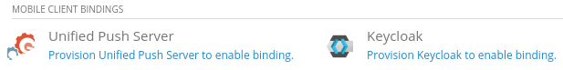

[[developing-apbs-locally]]
= Developing APBs Locally

This document outlines best practices for Aerogear APB development.
General information about the OpenShift Ansible Broker (OAB) and Ansible Playbook Bundles (APB) is included in the link:https://docs.openshift.com/container-platform/3.6/architecture/service_catalog/ansible_service_broker.html[OpenShift docs].

== Learn Opensift Ansible Broker

Below are two great and short videos for an excellent overview of the Openshift Ansible Broker:

* link:https://www.youtube.com/watch?v=iBVFq0X4ELw[Understanding Service Brokers on OpenShift, Part 1]
* link:https://www.youtube.com/watch?v=jFtPGhhEQoU[Understanding Service Brokers on OpenShift, Part 2]

== Prerequisites

Before doing local development of Aerogear APBs, you should have used the installer in this repo to setup a local OpenShift cluster. 
Additionally, we need to set up the appropriate permissions.

```bash
oc login -u system:admin
oc adm policy add-cluster-role-to-user cluster-admin admin
oc adm policy add-cluster-role-to-user access-asb-role admin
oc login -u admin
password: admin
```

This gives 3 distinct users:

* `developer` who logins in with "regular" perms
* `system:admin` who can't login to UI but is also an admin.
* `admin` who can login to the UI with cluster admin perms. **This is the user we will use for APB development**

== Installing the apb CLI

Install the apb CLI using one of the options described link:https://github.com/ansibleplaybookbundle/ansible-playbook-bundle/blob/master/docs/apb_cli.md#installing-the-apb-tool[here], we recommend you use the link:https://github.com/ansibleplaybookbundle/ansible-playbook-bundle/blob/master/docs/apb_cli.md#running-from-a-container[running from a container] method.

== Creating an APB

We recommend following the link:https://github.com/ansibleplaybookbundle/ansible-playbook-bundle/blob/master/docs/getting_started.md[tutorial] on how to write ABPs.

To create a `APB` module:

....
apb init
....

NOTE: Best practice is to name the APB ending with `-apb`.

== General APB considerations

=== Scaling

Use a link:https://kubernetes.io/docs/concepts/workloads/controllers/deployment/[Deployment], specifying the `replicas` property for containers that can scale horizontally. This will allow users of the APB to scale the service if needed.

For services with horizontally scalable containers that also require some configuration changes or API calls, consider using a link:https://kubernetes.io/docs/concepts/workloads/controllers/statefulset/[StatefulSet] e.g. a MongoDB replica set.

=== Passwords

Passwords should *not* be hardcoded with default values.
Instead, passwords should be empty by default, and generated if left blank by the APB user.
This allows the user to still specify a password if they want, but defaults to a more secure setup.

An example of password generation can be found in the link:https://github.com/aerogearcatalog/metrics-apb/blob/6ece42302fea2dd2add4e0d60913e68f2d42820d/roles/provision-metrics-apb/defaults/main.yml#L24[Metrics APB].


[source,yaml]
----
postgres_password: "{{ POSTGRES_PASSWORD | default(lookup('password', '/tmp/pass chars=ascii_letters,digits'), true) }}"
----

=== Labelling

Consider adding the same `app` label to *all* resources created in the APB.
e.g.

[source,yaml]
----
  labels:
    app: my-amazing-service
----

This will:

* allow all resources created by the APB to be easily identified with a label query (which can help with mass updating or deleting)
* group all the resources together on the OpenShift Project Overview screen into a single 'Application'

== Mobile APB considerations

When creating an APB for a mobile service, where possible use Kubernetes resources
(rather than Openshift resources) to ensure compatibility with Openshift and Kubernetes, eg. use a Kubernetes `Deployment` instead of an Openshift `DeploymentConfig`.

Only one instance of a service is expected in a namespace. If your service is intended to have more
than one service instance consideration must be given to the naming of objects.

=== ConfigMaps Vs Secrets

Separate the public and private configuration information in your APB.

Use `configMaps` for public information that a mobile client will need to use the service. 
It's possible that a mobile client will require some secret information such as an API key. This should be stored in the configMap.

To allow configMaps and secrets to be read by the Mobile CLI they should be labeled with `mobile: enabled`, `serviceName` and `serviceInstanceID`.

[source,yaml]
----
- k8s_v1_config_map:
    name: "{{ myService_configmap_name }}"
    namespace: "{{ namespace }}"
    labels:
      mobile: enabled
      serviceName: myService
      serviceInstanceID: "{{ _apb_service_instance_id }}"
    data:
      type: myService
      apiKey: "{{ api_key }}"
      public_client_secret: "{{ public_client_secret }}"
----

Use `secrets` for private information such as passwords and usernames.

[source,yaml]
----
- k8s_v1_secret:
    name: '{{ myService_secret_name }}'
    namespace: '{{ namespace }}'
    labels:
      name: myService
      mobile: enabled
      serviceName: myService
      serviceInstanceID: '{{ _apb_service_instance_id }}'
    string_data:
      admin_username: '{{ ADMIN_NAME }}'
      admin_password: '{{ ADMIN_PASSWORD }}'
----

For more information about this requirement see the original proposal link:https://github.com/aerogear/proposals/blob/master/apbs/create-secret-and-configmap-during-provision.md[here].

=== Tagging & Naming

For Mobile service APBs, make sure there is a `mobile-service` tag inside the `apb.yml` file:

[source,yaml]
----
...
tags: 
  - mobile-service
----

This tag is used by the serviceCatalog to group the APB with other mobile services.

If your Mobile Service can be bound to a Mobile Client, also include the `mobile-client-enabled` tag inside of the `apb.yml`:

[source,yaml]
----
...
tags: 
  - mobile-service
  - mobile-client-enabled
----

This will make your Mobile Service discoverable for Mobile Client bindings in the OpenShift UI:



To name the Service, make sure you include `serviceName:` inside of the `apb.yml` file in the metadata section, like:

[source,yaml]
----
...
metadata:
  displayName: Aerogear Sync Server
  console.openshift.io/iconClass: icon-nodejs
  serviceName: fh-sync-server
...
----

=== Bind Annotations
If your Mobile Service can be bound to a Mobile Client, it is possible to annotate the Mobile Client during the bind step of the APB.
This allows specific information about the Mobile Service (for example, links to the Service) to be displayed in the UI within the context of the Mobile Client.


The annotation should stick to the following format: 

[source,yaml]
----
org.aerogear.binding.<service-instance-name>/<key>: <value>
----

The value is a JSON string with the structure:

[source,json]
----
{"label": "<display-name>", "type": "[string|href]", "value": "<value>"}
----

An example of this can be seen in the Keycloak APB, link:https://github.com/aerogearcatalog/keycloak-apb/blob/4d160fd4724b68994ec0fe2ed7952930b2ef3d9e/roles/bind-keycloak-apb/tasks/main.yml#L107-L119[here]. These annotations should be link:https://github.com/aerogearcatalog/keycloak-apb/blob/4d160fd4724b68994ec0fe2ed7952930b2ef3d9e/roles/unbind-keycloak-apb/tasks/main.yml#L48-L60[removed on unbind]. 


=== Mobile Metrics Service Integration

To allow Prometheus to auto discover your custom services' metrics endpoint you need to include an annotation when creating the 
Kubernetes service in your provisioning task. More information about integration with the metrics service can be
found link:https://github.com/aerogear/proposals/blob/master/metrics/prometheus-metrics-endpoints-and-auto-discovery.md[here].

[source,yaml]
----
annotations:
  org.aerogear.metrics/plain_endpoint: /my-metrics-endpoint
----

An example can be seen link:https://github.com/aerogearcatalog/keycloak-apb/blob/4d160fd4724b68994ec0fe2ed7952930b2ef3d9e/roles/provision-keycloak-apb/tasks/provision-keycloak.yml#L67[here].


You can also link:https://github.com/aerogearcatalog/metrics-apb#how-to-add-a-new-dashboard-while-provisioning-a-service[include a  custom Grafana dashboard] 
for your service.

=== Issues with Bindable APBs
There is currently an link:https://github.com/openshift/ansible-service-broker/issues/847[issue] when setting an APB to be bindable without encoding binding fields for ansible service broker during provision. Ensure the provision successfully completes by encoding binding fields during provision when your APB is set to be bindable.

== Building an APB

To build an APB:

....
apb build
....

== Push an APB to a Local Openshift Cluster

Assuming your OpenShift cluster is up and running, you can push the APB image to the local OpenShift Docker Registry with:

....
apb push
....

Afterwards your APB is ready to be used from the _Service Catalog_.

[NOTE]
====
* If you push an APB and immediately try to provision it, sometimes it fails. Wait about 20 seconds and try again. This is a link:https://bugzilla.redhat.com/show_bug.cgi?id=1501523[known bug in the OpenShift Ansible Broker].

* Using `apb push` executes all phases at once, and automatically does a relist (`apb relist`) on the service catalog.
====

== Configure OpenShift Ansible Broker to use Dockerhub Regsitry

By default, the installer in this repo configures the OpenShift Ansible Broker to list images in the Service Catalog from OpenShift's local docker registry **and** from the `aerogearcatalog` organisation in Dockerhub.

You can also configure the OpenShift Ansible Broker to list images from your Dockerhub account.

There is no need to do this for local APB development workflow, but it may be useful to understand how to configure the OpenShift Ansible Broker to use images in a remote regsitry.

....
oc project ansible-service-broker
oc edit configmap broker-config
....

This will allow you to edit the OAB config in your terminal. Under the `registries` list, add another item:

....
- type: dockerhub
  name: <some name>
  org: <your dockerhub username>
  user: <your dockerhub username>
  pass: <your dockerhub password>
  white_list:
    - ".*-apb$"
....

You can also edit the `broker-config` Config Map in the OpenShift web console under the `ansible-service-broker` project. Check the link:https://github.com/openshift/ansible-service-broker/blob/master/docs/config.md[Ansible Service Broker configuration docs] for more examples.

== Debugging an APB 

When you run an `APB` a temporary namespace is created where a pod is created to run the provision process. By default that namespace is deleted when provisioning is complete.

If you want to review logs in that namespace after provisioning, set the following parameter for `broker-config`
```
    openshift:
      keep_namespace: true
```

== Bootstrapping an APB

When configuring the ansible broker
you can force the broker to reload images from your org.

----
apb bootstrap
----

== Testing an APB

Good practice is to have a special playbook for testing, called ``test.yml``. This playbook is used for quick verification of the 
implemented roles within the APB repository. If you include some/all roles (provision, bind, deprovision, unbind) in your
service, you should include a test task for that role so its functionality can be easily verified simply by 
running the ``apb test`` command.

There are examples of PR based testing set up using link:https://github.com/aerogearcatalog/metrics-apb/blob/master/Jenkinsfile[Jenkins] 
and link:https://github.com/ansibleplaybookbundle/mediawiki-apb/blob/master/.travis.yml[Travis CI].

More information about APB testing can be found link:https://github.com/ansibleplaybookbundle/ansible-playbook-bundle/blob/master/docs/getting_started.md#test[here].

== Automated Builds

Every `aerogear` APB has a Docker Hub repository set up for hosting images.
When a PR for an APB repository is merged to master, the Docker Hub respository detects this and kicks off an automated build.
If the build is successful, the resulting image is tagged as `latest`, replacing the previous `latest` image for that APB.

=== Setting up an Automated Build for APB Images

IMPORTANT: Docker repositories for APBs need to be created as an 'Automated Build' rather than a 'Repository'. There doesn't seem to be a way to add an automated build to a repository afterwards.

While signed into Docker Hub from a browser:

* Create > Create Automated Build
* Choose Github and allow access to repositories in the aerogearcatalog Github org
* Look for the repo in the list and click it
* Make sure the Repository Namespace & Name are correct e.g. aerogearcatalog/metrics-apb. Visibility public is fine.
* After creating, go to Build Settings
* Configure 'master' branch to build
* Configure tags that match a name of `/^[0-9.]+/` to build
* Save changes and Trigger a build for `master`. If successful, there should be an image with the 'latest' tag.
