[[mobile-client-builds]]
= Mobile Client Builds

== Open Mobile Client Builds
To download artifact you need navigate to Overview -> Mobile Clients -> <your-mobile-client>

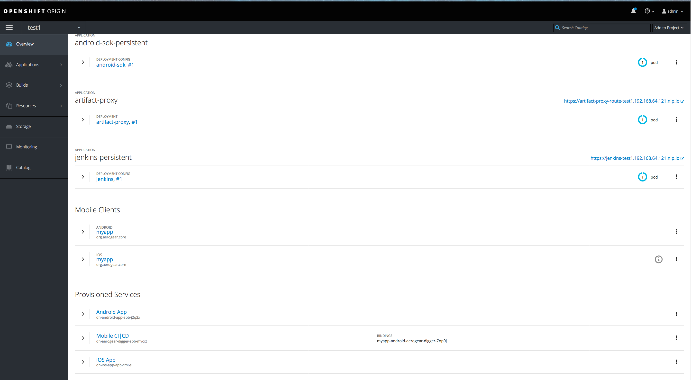

Then go to Builds tab to open mobile client builds

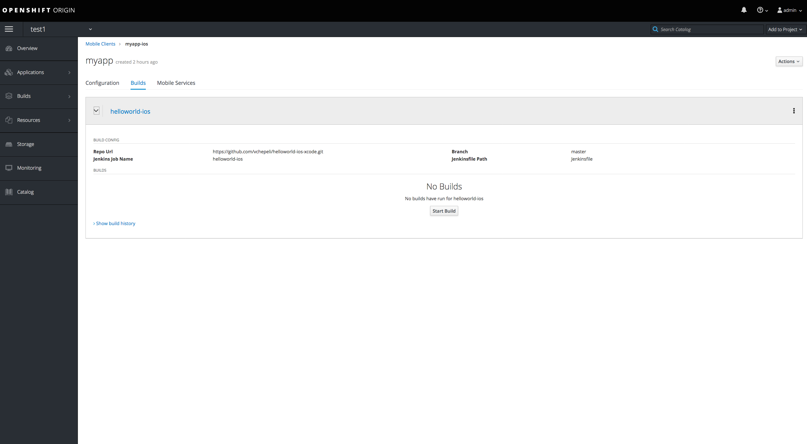

== Start Mobile Client Build
As you see, there are no builds currently available. To trigger a new build, press the [Start Build] button.
After starting a build you can see a notification that build was started and also
you can see that build was triggered under the BUILDS section

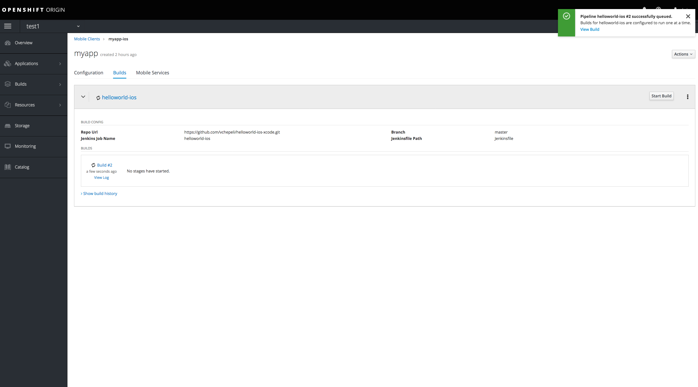

== Download Mobile Client Artifact
You need to wait until the build is completed and then press [Download] button

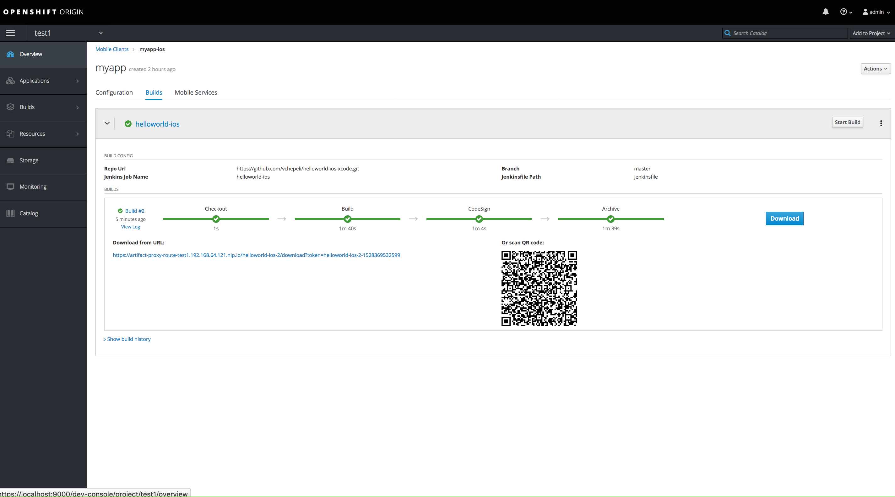

You should see a QR code and can use any QR code scanner applications in Google Play for Android or
or App Store for iPhone. If you have a QR code scanner installed then you need to scan the code and it should open the download URL you see on screen above.

[[mobile-client-manual-installation]]
= Manual Artifact Installation
If you dont have bar code scanner you can also download artifact from URL
in openshift web console(copy/paste it into your browser)
or directly download it from Jenkins when you click on [View Log] of build

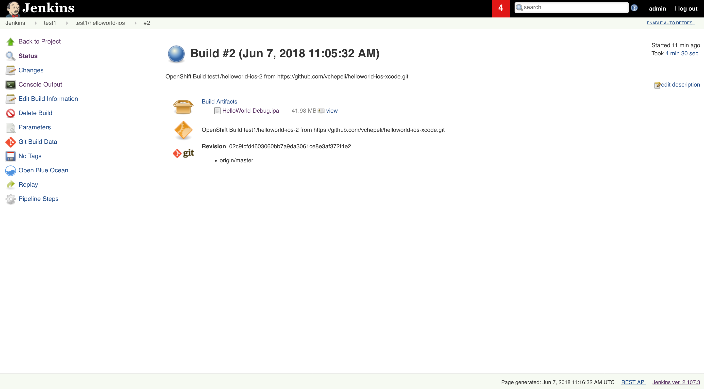

Connect device to your local machine then open XCode and navigate to Window > Devices and Simulators

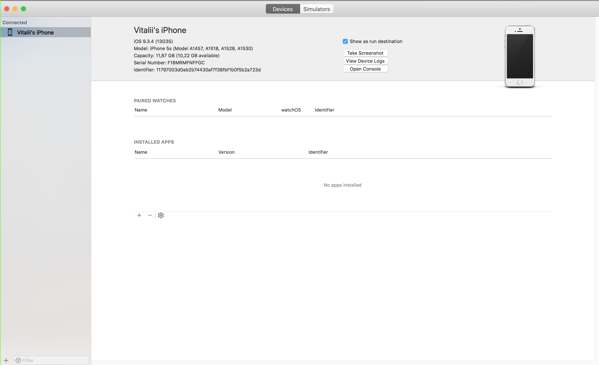

Then install your mobile application by pressing [+] button at the bottom, then choose your downloaded IPA file for installation

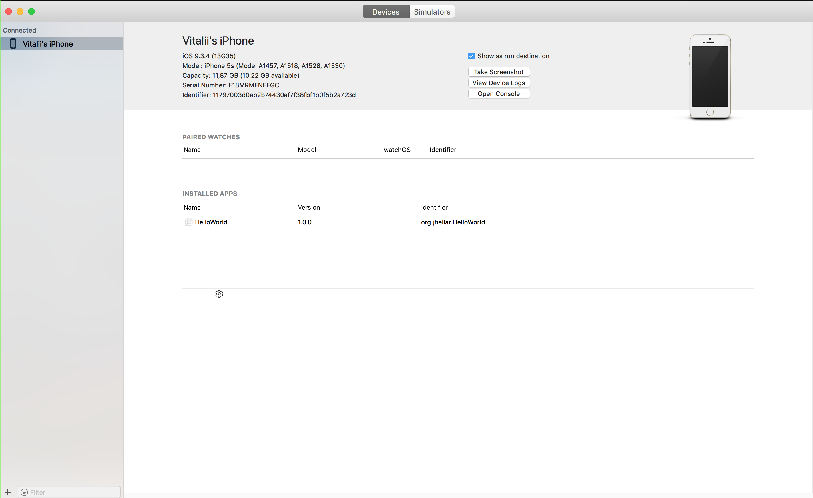

== Testing Installed Application
After installation was successful you can open the application on your device. In our case that is simple HelloWorld application

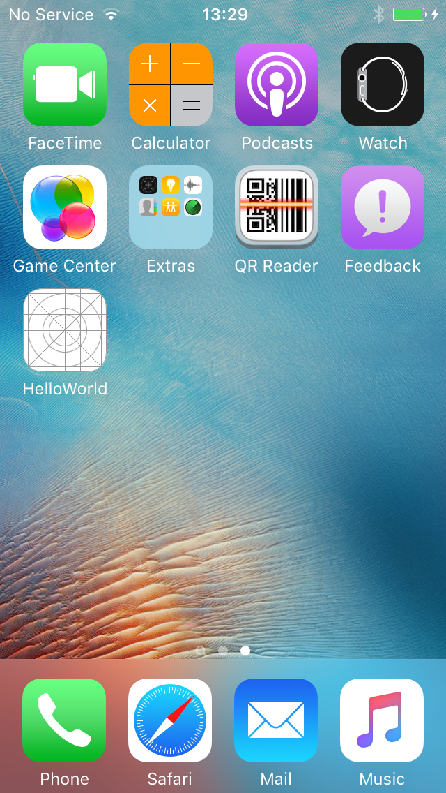

=== Open your Application
When HelloWorld application is opened you should see [Test] element

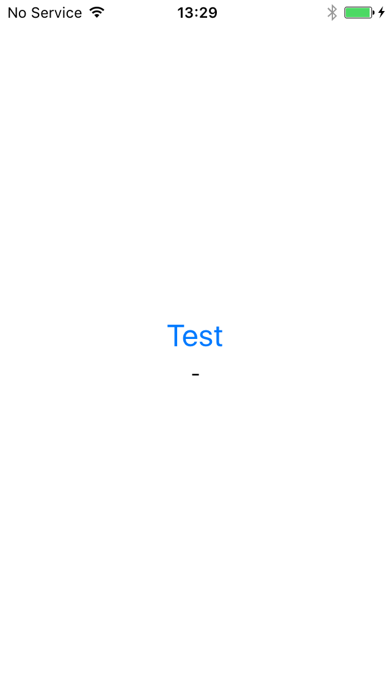

=== Test Application Logic
When you press on [Test] element then HelloWorld test should show up under the [Test] element

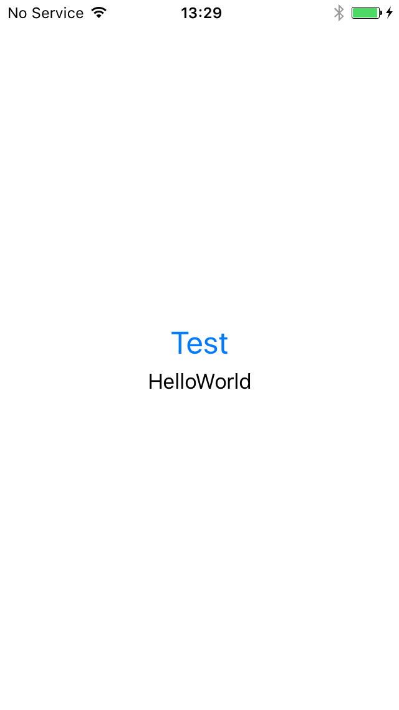

[[mobile-client-builds-android]]
For Android devices you need to follow exact same steps. For manual installation you might use Android Studio
to install APK file on your device or AVD.

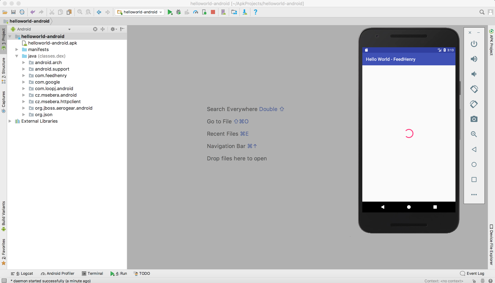