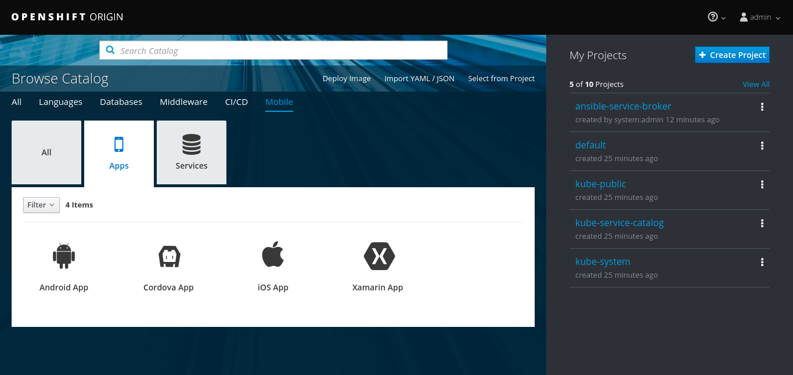

[[getting-started]]
= Getting started: Installation

[[overview]]
= Overview

The aim of this document is to get you to the point where you have installed and enabled the mobile pieces and setup required configuration that will make mobile development against OpenShift as simple and accessible as possible. It will also explain how you can verify your OpenShift installation is ready after to start developing your mobile application against once the installation has been completed.

In other guides we will show you how to make use of this installation by representing your mobile clients as resources in OpenShift, provisioning mobile enabled services such as authentication and push notification, along with consuming these services from your mobile clients via our SDKs.


[[installation-options]]
= Installation Options


- Minishift: https://github.com/aerogear/minishift-mobilecore-addon/blob/master/docs/minishift_install.adoc


[[mobile-addon-check-installation]]
=== Checking the installation

Login as the admin user which has cluster-admin access:

```
oc login -u admin -p admin
```

The ansible service broker pod needs to be running before we can use minishift's mobile features:

```
#not ready yet - both asb and asb-etcd pods need to be running
$ oc get pods -n ansible-service-broker
NAME               READY     STATUS              RESTARTS   AGE
asb-1-deploy       1/1       Running             0          2m
asb-1-pcwhr        0/1       ContainerCreating   0          1m
asb-etcd-1-gwcbj   1/1       Running             0          1m

#ansible service broker is ready
$ oc get pods -n ansible-service-broker
NAME               READY     STATUS    RESTARTS   AGE
asb-1-pcwhr        1/1       Running   0          22m
asb-etcd-1-gwcbj   1/1       Running   0          22m
```

You can open openshift web ui by running the following command (you will need to accept the self signed certificate):

- Minishift:

```
minishift console
```

You can use either the developer or the admin user in openshit web ui.

You should see the "mobile" tab under the catalog categories once logged in:



