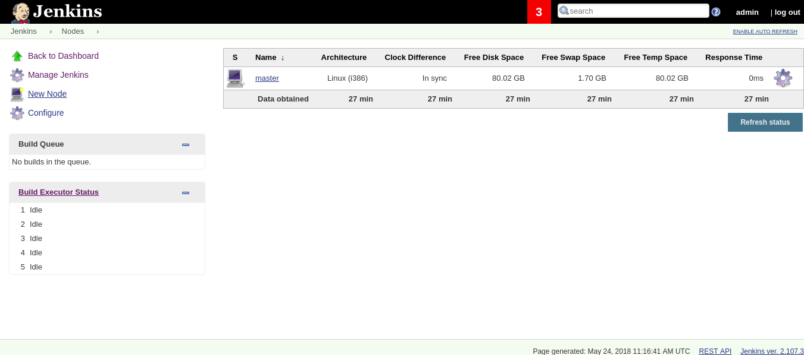
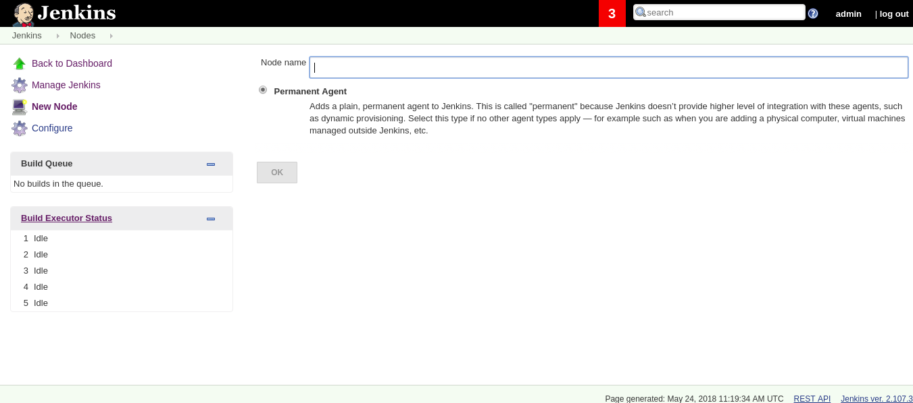
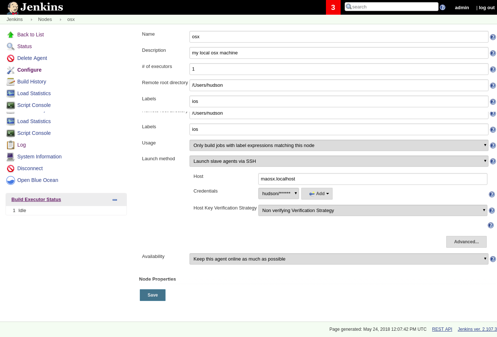
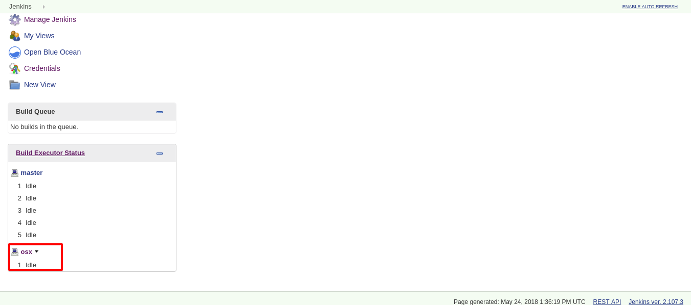

[[mobile-ci-cd-osx-config]]
= Mobile CI|CD OSX Config

This document explains how to add an external mac machine as a node (ssh agent) in Jenkins to build iOS apps.

== OSX Requirements

Required packages/tools to run ios builds:

* xcode and related tools
* java sdk
* ruby
* cocoapods
* user with enabled remote access

NOTE: Java SDK should be installed from http://www.oracle.com/technetwork/java/javase/downloads/jdk10-downloads-4416644.html[oracles official website]

Additonal packages/tools for supporting cordova apps:

* nodejs and npm
* cordova cli

== Jenkins requirements

Required jenkins plugins (already installed by mobile ci|cd service):

* xcode-plugin
* ssh-agent plugin

== Jenkins OSX Node

Now we need to add our osx node into jenkins:

image::images/mobile-ci-cd-osx-config-1.png[manage jenkins nodes]

Add a new node by clicking on "New Node" in the left menu:

Fill the form up with the required info:

* *Labels:* comma separated value to be used as node labels - this value can be later used by pipeline scripts
* *# of executors:* number of concurrent jobs that can be executed in this node
* *Usage:* we recommend using "Only build jobs with label expressions matching this node" so only jobs that specify this node specific label will be executed in this node
* *Remote Root directory:* it is recommended to use the users home folder to avoid permission issues

You can now save your node config and click on "re-launch node" (this may take a while depending on the nodes network speed).

You should now see your osx node in your node list:

