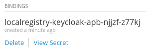
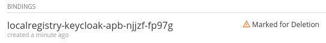

[[keycloak-service]]
= Keycloak Service

http://www.keycloak.org[Keycloak] is a complete identity and access management solution that provides
features such as single-sign on, user federation and authorization services.

See https://youtu.be/p8xvBA6UFRY[this video] which demonstrates how to use a shared Keycloak service and how to link another Keycloak service to it.

[[provision-keycloak-service]]
== Provision
Choose the type of service you would like to provision:

* Keycloak service
* Shared Keycloak service

Go to the OpenShift web console. Open the *Mobile* Tab > *Services* from the service catalog and select the Keycloak service.
This should open the Keycloak service provision wizard. Press the *Next* button and provide the configuration for the KeyCloak service

=== Keycloak service
This service type can be shared between different projects

*The configuration will ask for the following parameters:*

* *Add to Project (required)*: Create a new project or point to an existing project
* *Keycloak admin username (required)*: This user should be able to administer the realm or create new realms
* *Keycloak admin password (required)*: The password of the admin user for the Keycloak web console
* *Connect to an existing shared service*: Remain unchecked
* *URL of the shared service*: Remain empty
* *Name of the Keycloak realm (defaults to current namespace)*: Remain empty

After the service has been provisioned, you are then able to open the Keycloak web console
with the address `http://keycloak-<project-name>.<routing-suffix>` and the `<project-name>` realm should be available.

=== Shared Keycloak service
This service type is linked to an already existing original KeyCloak instance

*The configuration of a shared service needs the following parameters:*

* *Add to Project (required)*: Create a new project or point to an existing project
* *Keycloak admin username (required)*: This user should be able to administer the realm or create new realms
* *Keycloak admin password (required)*: The password of the admin user for the Keycloak web console
* *Connect to an existing shared service*: Should be checked
* *URL of the shared service*: This is the url of the existing Keycloak instance we want to link this service to
* *Name of the Keycloak realm (defaults to current namespace)*: Specify a new realm for the Shared Keycloak service

After the service is provisioned, you are then able to open its web console with the address of the shared service that was specified.
The realm specified in the configuration should also be available within this Keycloak instance.

[[bind-keycloak-service]]
== Bind
Bindings can be created for a provisioned Keycloak service, whether it's a shared one or not.

* Go to the project overview where your Keycloak service is provisioned.
* Select the Keycloak service under the *Provisioned Services* section. This should open up the service's details.
* Click *Create Binding* under the *Bindings* section. This should bring up the wizard for bind creation.
* Fill in the parameters:
- *Mobile client ID or Service Name (required)*: This is the name of the service or of the client the binding is for. This value will be used to create a public client or a bearer-only client for this service in the Keycloak realm.
- *Keycloak client type (required)*: The type of Keycloak client (xref:client-types[bearer-only or public]) that will be created for the mobile application in the Keycloak realm. 
* Click Bind

This will start the bind creation for the Keycloak service.
It creates the realm specified within the Keycloak instance. Within that realm, a bearer client or a public client is created with a
client id of `<service-name>-bearer` or `<service-name>-public`, depending on the client type chosen during bind. 

A secret is created with the details of the client created in the Keycloak instance. This can be viewed
by clicking *View Secret* that is associated with the bind object.

---

[[client-types]]
=== Keycloak client types

There are two client types that may be created in the Keycloak realm during bind: _public_ or _bearer-only_.

*public*

Public access type is for client-side clients that need to perform a browser login. With a client-side application there is no way to keep a secret safe. Instead it is very important to restrict access by configuring correct redirect URIs for the client.

*bearer-only*

Bearer-only access type means that the application only allows bearer token requests. If this is turned on, this application cannot participate in browser logins.

[[unbind-keycloak-service]]
== Unbind
To unbind a service or client from the Keycloak service, click *Delete* next to the binding that represents the association between the service/client. A *Mark for Deletion* message will appear beside it which denotes that the unbind process 
has started.

Once the unbind process has finished, the bind object will have been deleted as well as any other resources and clients associated with it.

[[deprovision-keycloak-service]]
== Deprovision
In order to delete a provisioned Keycloak service, select the service menu and click *Delete*. A notification should
appear that the service has now been *Marked for Deletion*.

=== Keycloak service
Deleting a Keycloak service will delete the following resources:

* route
* services
* deployments
* secrets
* config maps
* persistent volume claims

NOTE: When the deprovision finishes, the Keycloak instance should be removed and it's web console should not be reachable.

=== Shared Keycloak service
Deleting a Shared Keycloak service will delete the following resources:

* clients created in the specified realm
* secrets
* config maps

NOTE: When the deprovision finishes, the realm created by provisioning the Shared KeyCloak service should still exist
