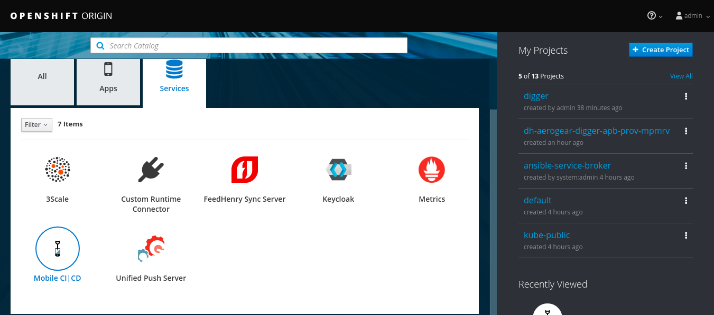
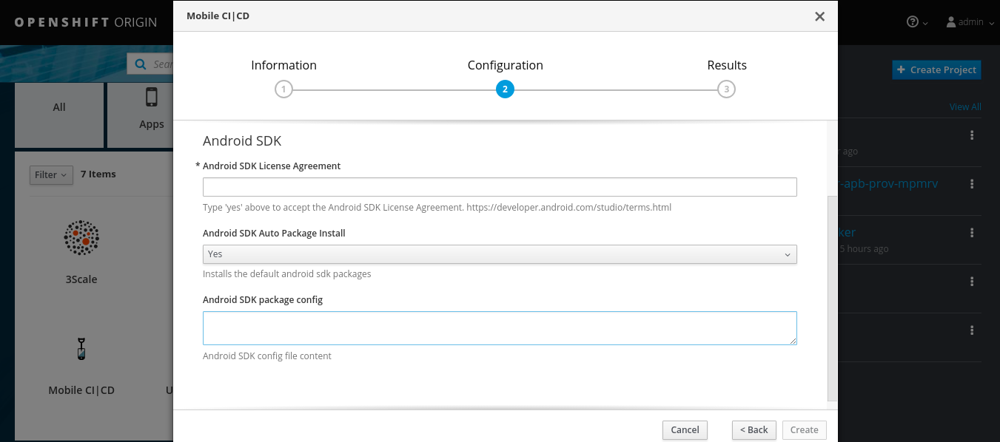
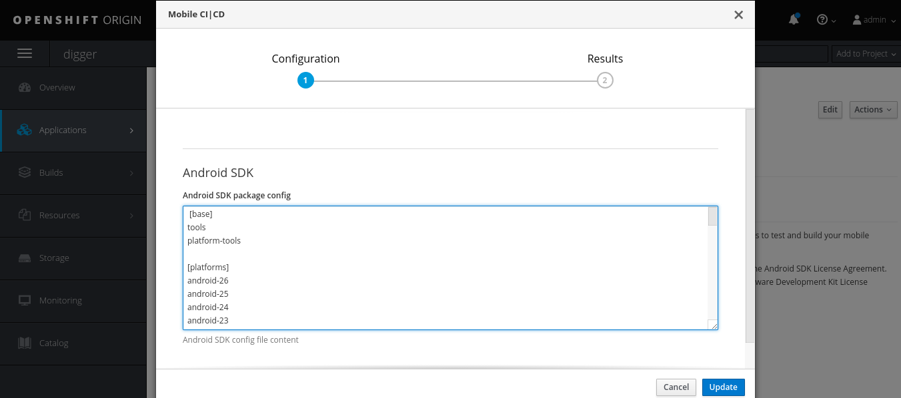

[[provisioning-mobile-ci-cd]]
= Mobile CI|CD provisioning

== Overview

Mobile CI/CD, which is based on Aerogear Digger, enables mobile continuous integration and deployment by using jenkins pipelines on top of openshift.

The Mobile CI/CD service depends on the following container images:

* openshift/jenkins-2-centos7:v3.10
* aerogear/digger-android-slave-image
* aerogear/digger-android-sdk-image

Aerogear Digger documentation can be found at: https://aerogear.org/digger.

== Provisioning

Select the "Mobile" tab in openshift service catalog and click on "Mobile CI|CD":





* *Android SDK License Agreement:* must be accepted in order to provision digger
* *Android SDK Auto Package Install:* Will install the default android sdk packages if set to "yes" (https://github.com/aerogearcatalog/aerogear-digger-apb/blob/master/roles/provision-buildfarm-apb/files/default.cfg)
* *Android SDK package config:* Optional field to describe a custom collection of android sdk packages to be installed - this field will be ignored if "Android SDK Auto Package Install" is set to "Yes"

The service wont't install any android sdk packages if you set "Android SDK Auto Package Install" to "No" and leave "Android SDK package config" empty which can be installed later by editing/updating the service.

NOTE: The "Android SDK package config" field will be ignored if you choose to install the default android sdk packages.

== Updating

You can update which android sdk packages should be available in your mobile ci/cd instance by editing the service instance:



Edit the "Android SDK package config" field as you see fit to add or remove packages from your mobile ci/cd instance.

NOTE: Removing a package will ensure it gets deleted from the android sdk pod.


== Jenkins Plugins

The following mobile specific jenkins plugins are installed as part of the provisioning process:

* Android Signing(2.2.4): http://wiki.jenkins-ci.org/display/JENKINS/Android+Signing+Plugin
* Openshift Sync(1.0.18): https://wiki.jenkins-ci.org/display/JENKINS/OpenShift+Sync+Plugin

== The SDK config file

Digger uses a config file in INI format to describe which android sdk packages should be installed.

The ansible playbook bundle contains a default config file if none is provided: https://github.com/aerogearcatalog/aerogear-digger-apb/blob/master/roles/provision-buildfarm-apb/files/default.cfg

The config file is organized in sections, each section representing an Android SDK package namespace that specifies which packages/tools should be installed.

The following config describes a list of android platforms and build-tools that should be installed:

```ini
[platforms]
android-26
android-25
android-24

[build-tools]
26.0.2
26.0.1
26.0.0
```

There is one optional reserved section name which specifies the default debug keystore metadata:

```
[keystore]
alias=AndroidDebugKey
name=AG
unit=AeroGear
org=RedHat
loc=Waterford
state=WD
country=IRL
storepass=android
keypass=android
```
