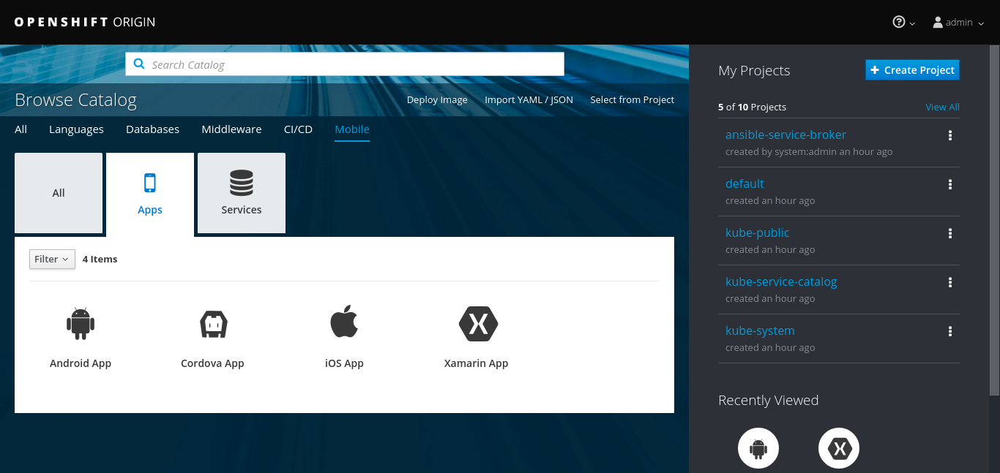
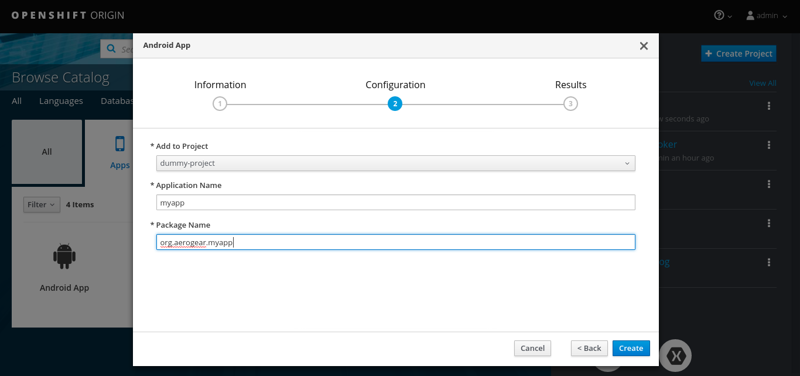
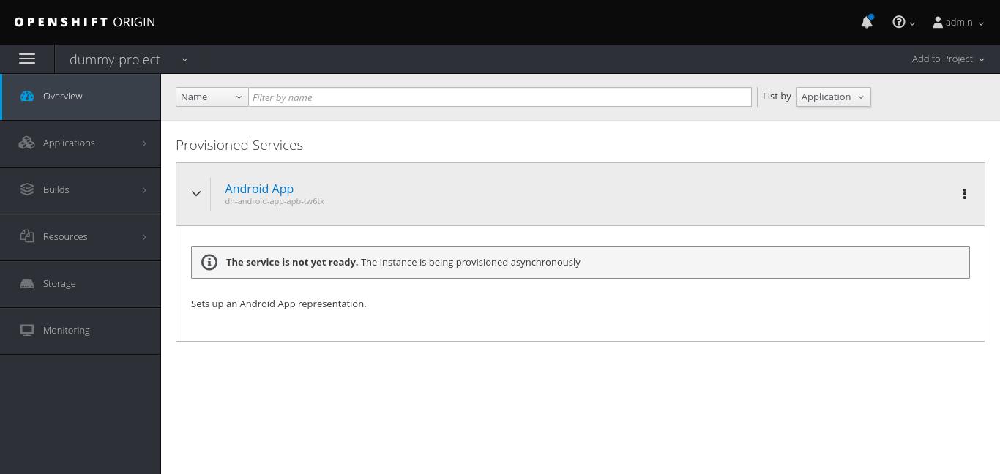
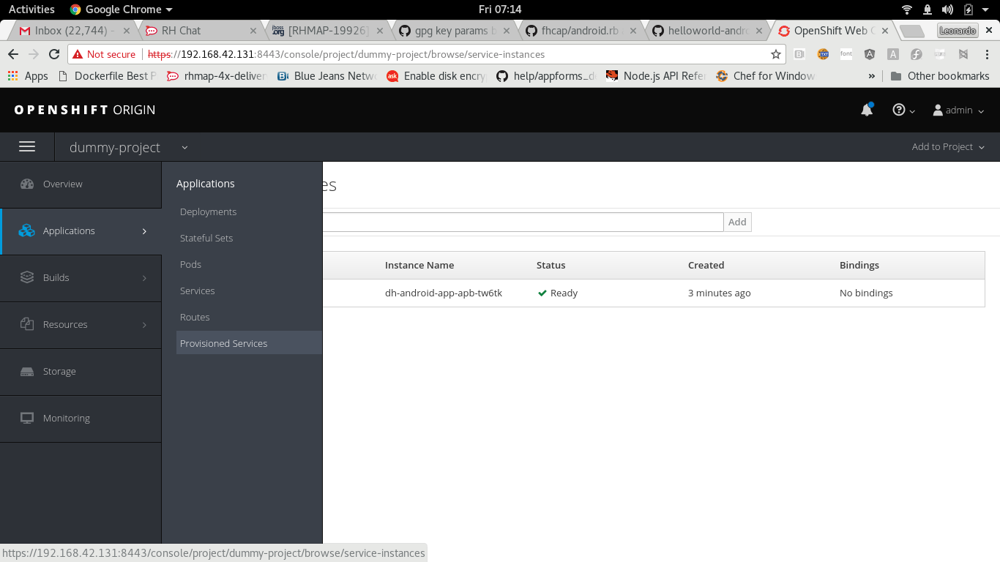
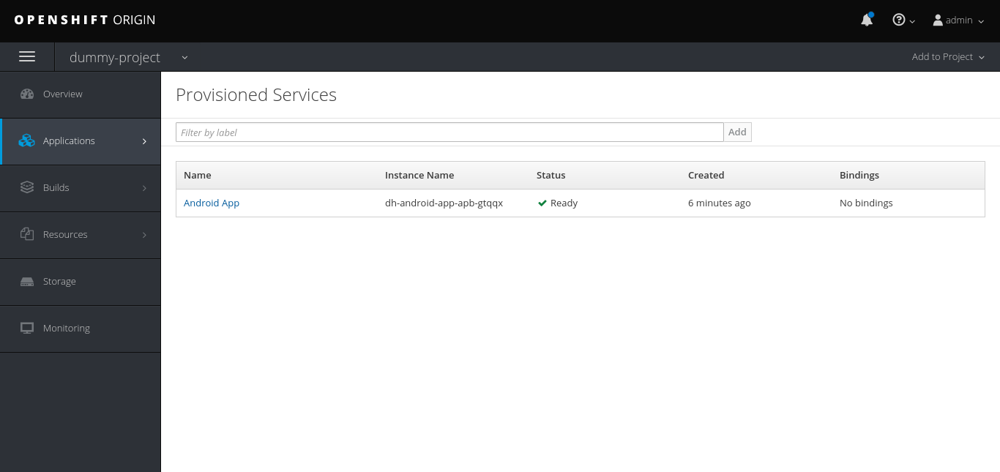
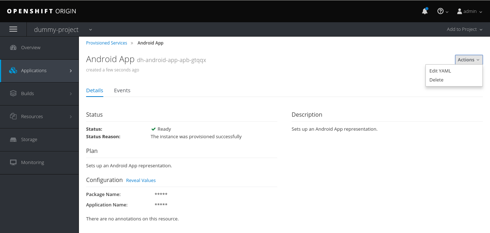

[[provisioning-mobile-apps]]
= Mobile Client provisioning

== Overview

This document will outline how we represent your mobile client within your OpenShift project, how to create a representation and what that representation is used for.

== The Mobile client representation

This is a custom resource definition in OpenShift that allows us to give you a visual representation of your mobile client and the services it is making use of.
From within the UI as part of the mobile client, you can see which services you can bind your mobile client to, and which services your client is already bound to. You can also view the specific configuration for that client, that will allow your mobile application to communicate and integrate with these services.

== Supported platforms/types

* Android
* iOS
* Cordova
* Xamarin

[[creatting-mobile-apps]]
== Creating Mobile Apps

[[openshift-ui]]
=== Openshift UI

Once the installer is complete you should be able to access OpenShift at
https://192.168.37.1:8443/console/. You will need to accept the
self-signed certificate.

==== Create a new client

Under the `mobile` tab select `apps` then choose a desired platform for your client app:



Fill the client app form with the proper information:



You can check your client app status in your project now (provisioning might take a while):



===== Retrieve an existing client

You can check your client app info by going to `Applications > Provisioned Services` and selecting your client app:





===== Delete an existing client

You can delete your client app by clicking on `Actions > Delete` under the client app details:




[[mobile-cli]]
=== Mobile CLI

==== Usage

===== Create a new client

Command:

```
mobile create client $unique_id $type $package_name [flags]
```

Example:

```
mobile create client helloworld-android android org.aerogear.helloworld-android [flags]
```

Output:

* id: unique client id in openshift
* name: user defined client app name
* clienttype: client app type
* appidentifier: user defined client app package name/bundle identifier

===== Retrieve an existing client

Command:

```
mobile get client $client_id [flags]
```

Example:

```
mobile get client helloworld-android [flags]
```

Output:

* id: unique client id in openshift
* name: user defined client app name
* clienttype: client app type
* appidentifier: user defined client app package name/bundle identifier
* apikey: client app api key to be used with other openshift mobile services

===== Delete an existing client

Command:

```
mobile delete client $client_id [flags]
```

Example:

```
mobile delete client helloworld-android [flags]
```

Output:

None - returns 0 exit code if successful.

===== Available flags:

* --namespace: openshift namespace to be used (required if using standalone mobile cli)
* --output: cli output format to be used (json, yml, template or table)
* --quiet: will not print unnecessary output to stdout such as warnings


[[next-steps]]
== Next Steps

* Provision a service:./provision-keycloak-apb.adoc[Provision Sercurity Service].
